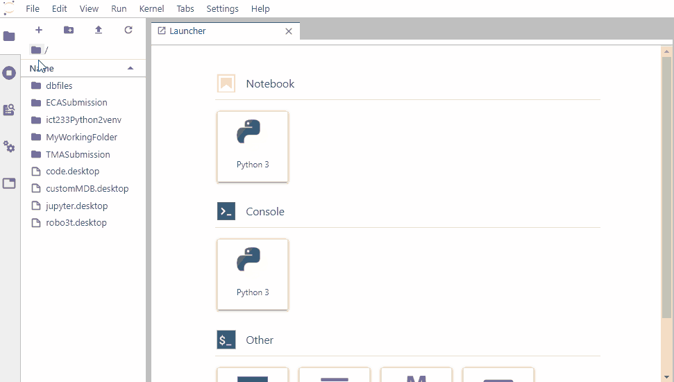
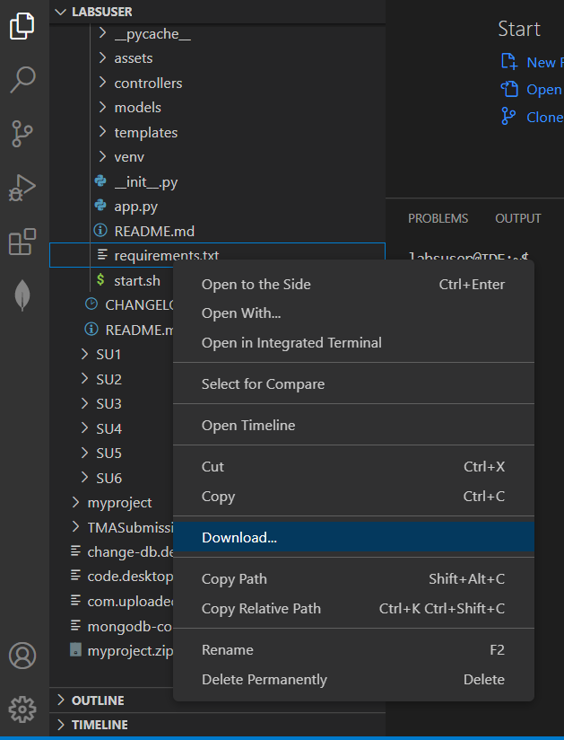
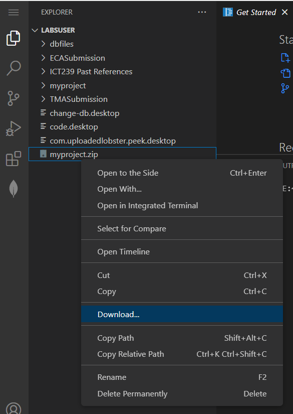
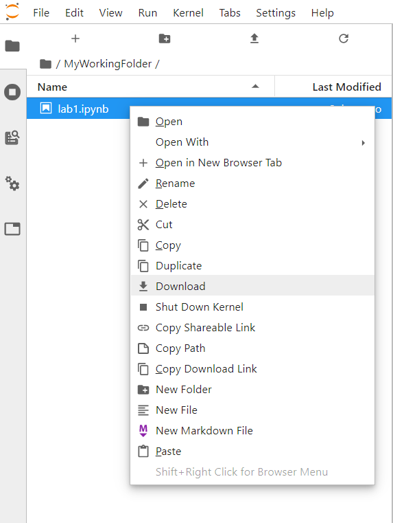
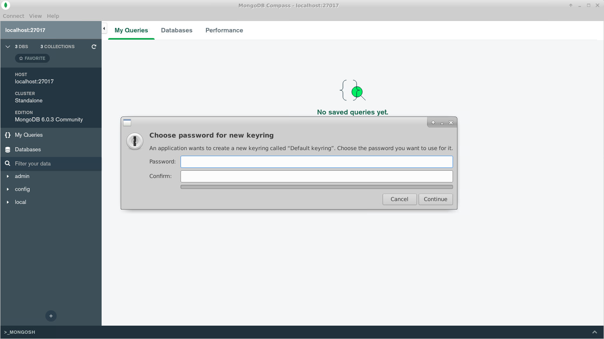
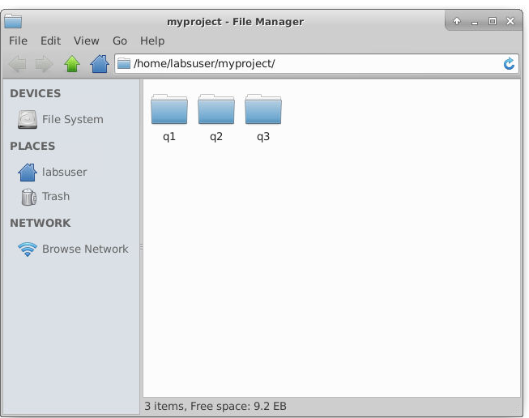
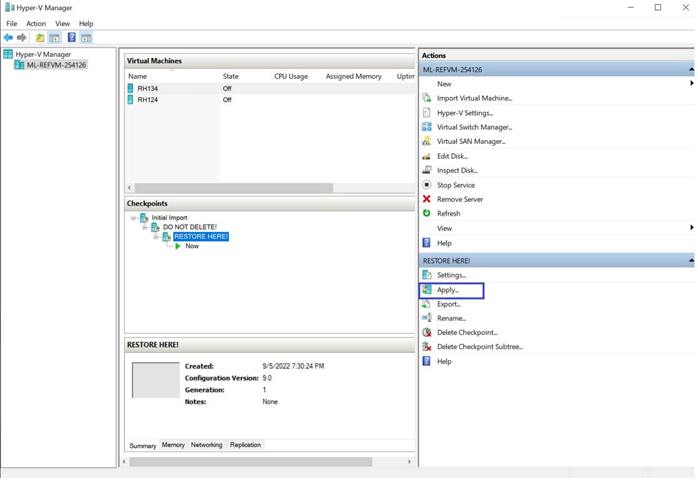
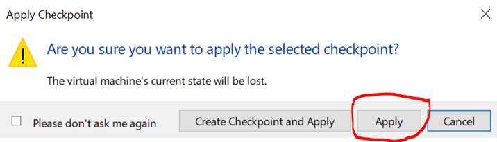

# FAQ - Vocareum

## 1. Disconnected from Vocareum Labs / Cannot access Vocareum Labs

For Vocareum labs, there is **a time limit of 5 hours** for each session. The session will be automatically disconnected once the 5 hours is up. 

You can check on the time left for your session from your work space, beside the “Start Lab” button (see image below). 


You can re-access your lab by closing the lab and starting a new lab session using the "End Lab" and "Start Lab" buttons. 


If the above method does not work, you can click on "Vocareum Lab" in Canvas to reload the Vocareum lab to start a new lab session.


If you have concerns about your submission, click [here](#2-submission-deadline-rules) for more info.

---

## 2. Submission deadline rules


**Before deadline**
- Students are able to submit multiple times before the assignment deadline. 

**After deadline**
- Once the deadline is over, those who have at least 1 submission before deadline cannot submit again. 
- Those who have no submission before the deadline will only have 1 chance of submitting their assignment.

---

## 3. How do I upload my project to Vocareum?

**For VSCode IDE**

Simply drag and drop your directory into the explorer of IDE on Vocareum. See below.


**For Jupyter Lab IDE**

To upload files to JupyterLab, click into the directory you wish to upload to. Click on the upload button and select the file to upload.



---

## 4. How do I download files from Vocareum?

**For VSCode IDE**

To download a single file, right click on the file and click on "Download".



To download multiple files at one time, follow the steps below.

Step 1: Zip your files into an archive.

- Go into your Vocareum `desktop`.
- Put your files into a directory.
- Right click and select "Create Archive". 
- Select `zip` for the the "Archive Type" and click on "Create".


Step 2: Download via VSCode

- Go to the VSCode IDE.
- Right click on the zip file and select "Download"




**For JupyterLab IDE**

- Right click on the file you wish to download.
- Select "Download".



---

## 5. Mongodb is disconnected. I am facing an error trying to reconnect Mongodb.

For a quick fix, run the following commands on your terminal.
```
cd /home/labsuser/dbfiles
rm -rfv WiredTiger.lock mongod.lock
sudo mongod --dbpath /home/labsuser/dbfiles --repair
```

Once you run the above commands, proceed to restart your lab by pressing “End Lab” on the top right corner of your workspace and press “Start Lab” to start it again.


<details>
  <summary>Click for explanation.</summary>  
Usually when this happens, it means that the previous Mongodb run was not logged off properly and the lock file was not removed. The commands above try to remove hte lock file.

</details>

---

## 6. I forgot my password for my mongodb-compass keyring, what can I do?

Reset your password:
1. In Vocareum's terminal, run the command: `rm -rfv ~/.local/share/keyrings/Default_keyring.keyring` 
2. Close and re-launch mongodb-compass for the prompt to set the password for a new keyring. 

3. Enter a new password for the keyring.

---

# FAQ - Submitter

## 1. If I have 1 hour left to my submission deadline and I do not have any docx, how can I submit?

You can always create a new docx before submission. Your `.docx` document cannot be empty. 

Note: You are responsible for your own submission and submitting on time.

---

## 2. If I have multiple flask projects (i.e TMA for q1 and q2), how do I prepare for submission?

You can put all of your projects under one directory and select the directory to zip up all the projects together for submission. 



---

## 3. I submitted wrongly. What should I do?

If you made a mistake for your submission, just resubmit and ignore the last submission. We will only keep the latest submission. 

---

## 4. My virtual environment is not called `venv`. What should I do?

Please run the following command on a test project first. Duplicate your project to test it. You should delete your current venv. Then run the following command to recreate venv:
```
python3 -m venv venv
source /venv/bin/activate
pip3 install -r requirements.txt
```

---

## 5. My TMA/ECA project is on my laptop. How do I submit it on Vocareum using the submitter?

Note: All TMA/ECA projects should be done on Vocareum. If you are working on your local machine, it is your responsibility to make it compatible to Vocareum. See <insert link to state that all work should be done on vocareum>

To submit on Vocareum:
1. [Upload your project to Vocareum](#3-how-do-i-upload-my-project-to-vocareum)
2. From the submitter, select the project directory to submit.
3. Click on the "Submit" button from Vocareum Lab's workspace.

---
  
## 6. Which file format is acceptable for recording?

We only accept **gifs** for recording. You need to zip up the recordings using the Vocareum zip utility.

  
---
  
## 7. The submitter is rejecting my submission because of the virtual environment. What can I do? 

You have two options. Option one is to delete all virtual environments. Another options is to name your virtual environment as **venv**. 

To recreate a virtual environment, follow the commands below. 
```
python3 -m venv venv
source /venv/bin/activate
pip3 install -r requirements.txt
```
  
Then, zip up your submission and try submitting again. 
  
---

## 8. The submitter is rejecting my submission because of my recordings. What can I do? 
  
The submitter only allow gifs as the recording. If you are using mp4, please save your recording as gif and resubmit them.

If you have multiple recordings, please zip up using the vocareum utility. 
  
---

# FAQ - ALS

## 1. (For ICT257 students) What to do if `rht-vmctl reset <vmname>` does not achieve its intended objective and you are still stuck with a broken `<vmname>`?

Perform the following to revert to the original checkpoint:
1. Open Hyper-V Manager
2. Click on that particular VM
3. Under the checkpoints section, click on the “RESTORE HERE!” checkpoint
4. Click on Apply button on the right

5. In this Apply Checkpoint prompt, click on Apply button.

6. It will revert back to the default state and please try to start the virtual machine again.

---

## 2. Second faq

---
# FAQ - AWS

## 1. First faq

---
## 2. Second faq

---
