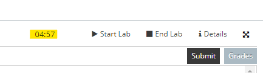
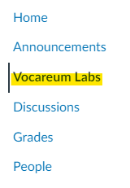
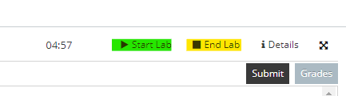
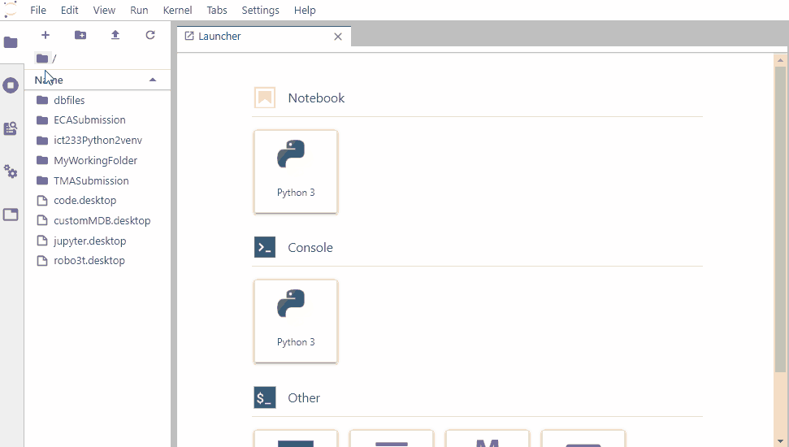
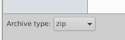
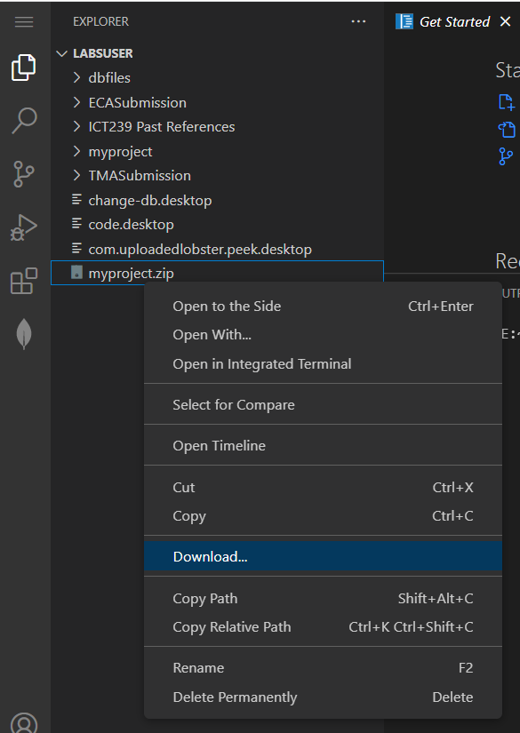
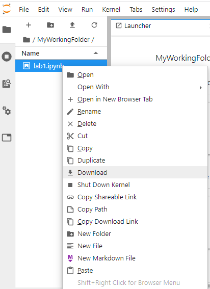
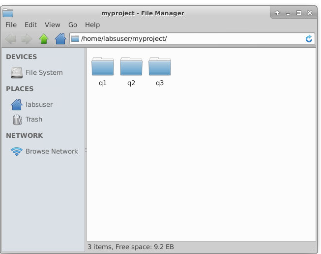

# FAQ - Vocareum

## 1. Disconnected from Vocareum Labs / Cannot access Vocareum Labs

For Vocareum labs, there is **a time limit of 5 hours** for session. The session will be automatically disconnected once the 5 hours is up. 

You can check on the time left for your session from your work space, beside the “Start Lab” button (see image below). 



You can re-access your lab by closing the lab and starting a new lab session using the "End Lab" and "Start Lab" buttons. 


If the above method does not work, you can click on "Vocareum Lab" in Canvas to reload the Vocareum lab to start a new lab session.




If you have concerns about your submission, click [here](#3-submission-deadline-rules) for more info.

---

## 2. Mongodb is disconnected. I am facing an error trying to reconnect Mongodb.

For a quick fix, run the following commands on your terminal.
```
cd /home/labsuser/dbfiles
rm -rfv WiredTiger.lock mongod.lock
sudo mongod --dbpath /home/labsuser/dbfiles --repair
```

Once you run the above commands, proceed to restart your lab by pressing “End Lab” on the top right corner of your workspace and press “Start Lab” to start it again.




<details>
  <summary>Click for explanation.</summary>  
Usually when this happens, it means that the previous Mongodb run was not logged off properly and the lock file was not removed. The commands above try to remove hte lock file.

</details>

---

## 3. Submission deadline rules


**Before deadline**
- Students are able to submit multiple times before the assignment deadline. 

**After deadline**
- Once the deadline is over, those who have at least 1 submission before deadline cannot submit again. 
- Those who have no submission before the deadline will only have 1 chance of submitting their assignment.

---

## 4. How do I upload my project to Vocareum?

**For VSCode IDE**

Simply drag and drop your directory into the explorer of IDE on Vocareum. See below.


**For Jupyter Lab IDE**

To upload files to JupyterLab, click into the directory you wish to upload to. Click on the upload button and select the file to upload.



---

## 5. How do I download files from Vocareum?

**For VSCode IDE**

Step 1: Zip your files into an archive.

- Go into your Vocareum `desktop`.
- Put your files into a directory.
- Right click and select "Create Archive". 
- Select `zip` for the the "Archive Type" and click on "Create".



Step 2: Download via VSCode

- Go to the VSCode IDE.
- Right click on the zip file and select "Download"




**For JupyterLab IDE**

- Right click on the file you wish to download.
- Select "Download".



---

# FAQ - Submitter

## 1. If I have 1 hour left to my submission deadline and I do not have any docx, how can I submit?
You can always create a new docx before submission.

Note: You are responsible for your own submission and submitting on time.

---

## 2. If I have multiple flask projects (i.e TMA for q1 and q2), how do I prepare for submission?

You can put all of your projects under one directory and select the directory to zip up all the projects together for submission. 



---

## 3. I submitted wrongly. What should I do?

If you made a mistake for your submission, just resubmit and ignore the last submission. We will only keep the latest submission. 

---

## 4. My virtual environment is not called `venv`. What should I do?

Please run the following command on a test project first. Duplicate your project to test it. You should delete your current venv. Then run the following command to recreate venv:
```
python3 -m venv venv
source /venv/bin/activate
pip3 install -r requirements.txt
```

---

## 5. My TMA/ECA project is on my laptop. How do I submit it on Vocareum using the submitter?

Note: All TMA/ECA projects should be done on Vocareum. If you are working on your local machine, it is your responsibility to make it compatible to Vocareum. See <insert link to state that all work should be done on vocareum>

To submit on Vocareum:
1. [Upload your project to Vocareum](#4-how-do-i-upload-my-project-to-vocareum)
2. From the submitter, select the project directory to submit.
3. Click on the "Submit" button from Vocareum Lab's workspace.

---

# FAQ - ALS

## 1. First faq

---

## 2. Second faq

---
# FAQ - AWS

## 1. First faq

---
## 2. Second faq

---
