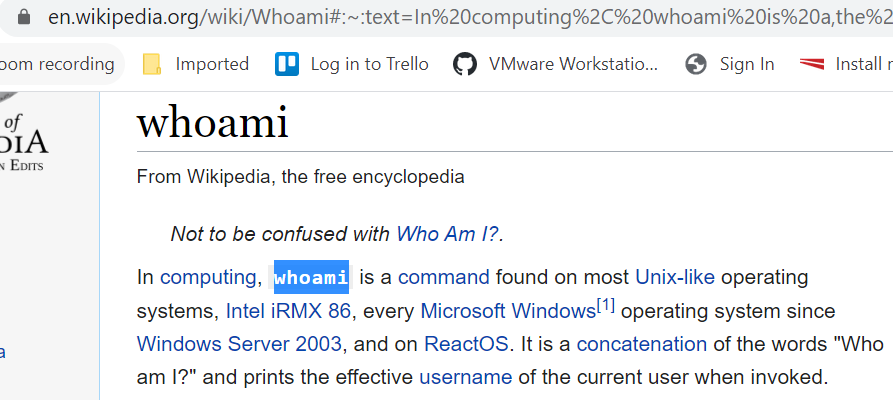
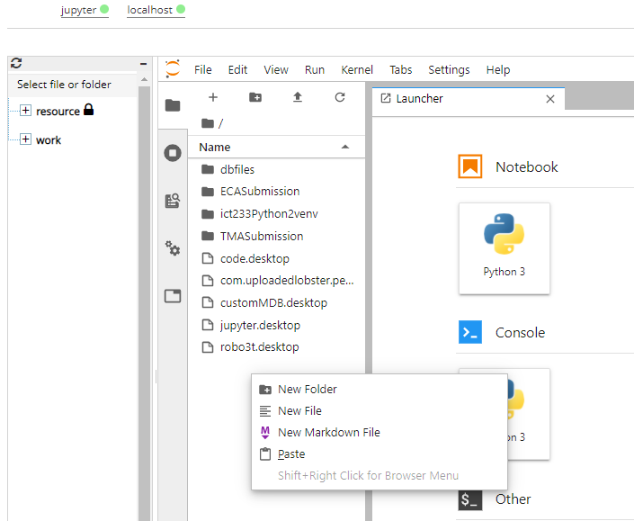
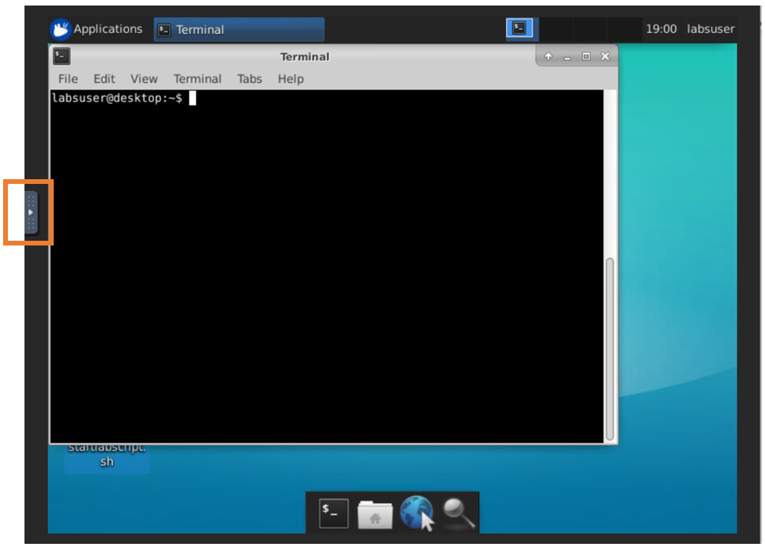
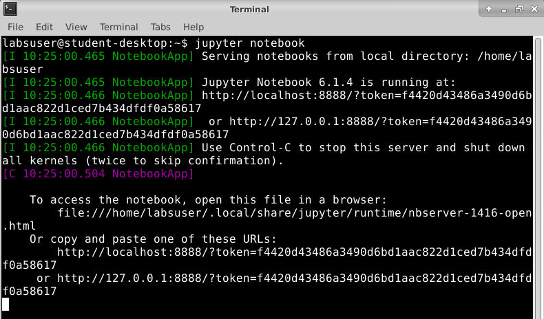
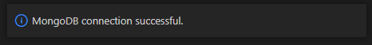

**sCHANGE LOG**

**\[Version 0.1\] -- 26/01/2021**

-   [Section 4, 6 and 7:]{.underline} Added new sections for respective
    Eclipse, Pycharm and Thonny IDE.

**\[Version 0.2\] -- 27/01/2021**

-   [Section 14:]{.underline} Clarified the page numbering on check list
    that needs to be resynched.

-   [Annexe:]{.underline} Clarified the use of DBeaver.

-   [FAQ:]{.underline} Removed question 3.

**\[Version 0.3\] -- 29/01/2021**

-   [Section 4:]{.underline} Added instruction to configure the
    interpreter to Python 3 for Eclipse.

-   [Section 12:]{.underline} Added instruction to copy and paste text
    from local desktop to virtual desktop.

-   [Section 14:]{.underline} Inserted screen capture for submission of
    assignment and zipped file to Canvas.

-   [Section 2 and Optional:]{.underline} Moved the procedure for
    copying startlabscript file to bottom and labelled as optional.

-   Released for ICT133_JAN21 class.

**\[Version 0.4\] -- 01/02/2021**

-   [Section 2:]{.underline} Edited the instructions for using command
    line to run startlabscript file.

-   [Section 8:]{.underline} Added instructions to launch Jupyter
    Notebook application for Python 2 environment.

-   Released for ICT233_JAN21 class.

**\[Version 0.5\] -- 22/02/2021**

-   [Section 8:]{.underline} Added a new section on Packet Tracer for
    ICT259.

**\[Version 0.6\] -- 23/02/2021**

-   [Section 3:]{.underline} Updated the instructions to configure
    desktop screen.

**\[Version 0.7\] -- 07/03/2021**

-   [Section 2:]{.underline} Changed startlabscript mechanism.

-   [Section 9:]{.underline} Added a new section to start MongoDB
    server. This approach is to (1) preserve mongoDB database by storing
    user data under dbfiles folder (2) resolve the issue when server
    fails to start.

-   [Section 13:]{.underline} Updated the method for recording by using
    LICEcap.

-   [Section 14:]{.underline} Replaced screenshots using a different
    folder name, not to be confused with the designated submission
    folder.

-   [Section 14:]{.underline} Applied requirement 1 & 2 for ICT233.

-   [Section 14:]{.underline} Added instruction to check submission in
    WorkSpace.

-   [Appendix:]{.underline} Removed section on Copy Startlabscript.

-   [Appendix:]{.underline} Added information for troubleshooting
    MongoDB connection.

**\[Version 0.7b\] -- 11/05/2021**

-   [Appendix A-4:]{.underline} Updated the command line.

-   [Appendix A-]{.underline}5: Added new appendix for reconnecting
    virtual desktop.

**\[Version 0.8\] -- 12/05/2021**

-   [Section 13:]{.underline} Updated the method for recording by using
    Peek.

**\[Version 0.8b\] -- 06/07/2021**

-   [Section 11:]{.underline} Added a new section on EASY68K for ICT114.

**\[Version 0.9c\] -- 12/01/2022**

-   Implemented Theia, Jupyter lab container and reorganized the
    sections.

**\[Version 0.9e\] -- 11/03/2022**

-   [Section 1]{.underline}: Added new section for browser requirements
    and configurations as advised by Vocareum.

-   [Section 3.1]{.underline}**:** Added new section to provide steps
    for copy/paste text from local desktop to Theia.

-   [Section 3.2]{.underline}**:** Added new section to create
    launch.json in Theia IDE for running Flask.

-   [Section 3.3]{.underline}**:** Provided steps for viewing or
    changing the version of the Python Interpreter (if necessary) in
    Theia IDE.

-   [Section 5]{.underline}: Remove to configure resolution by command
    line since remote resizing works well.

-   [Section 6.4]{.underline}: Updated Point C to refer student to
    Appendix A-6 for new account registration.

-   [Section 9]{.underline}**:** Updated Point G in regards to
    resubmission.

-   [Appendix A-5]{.underline}**:** Provided steps for new account
    registration via Skills For All.

**\[Version 0.9f\] -- 16/03/2022**

-   [Section 6.4.1]{.underline}: Added new section for retrieval of file
    for lab exercise.

**\[Version 0.9g\] -- 24/03/2022**

-   [Section 6.4]{.underline}: Updated the screenshot for Skilsforall
    login method.

**\[Version 0.9h\] -- 29/03/2022**

-   [Appendix A-6]{.underline}**:** Provided steps for new account
    registration via Networking Academy.

**\[Version 1.0\] -- 28/07/2022**

-   [Section 3 to 3.4 and 6.3]{.underline}**:** Updated the instructions
    for the new requirements of ICT239.

**\
**

Student User Guide for

Virtual Lab Infrastructure (VLI) Workspace

**\
**

# **TABLE OF CONTENTS** {#table-of-contents .TOC-Heading}

[**1.** **BROWSER REQUIREMENTS AND CONFIGURATIONS**
[3](#browser-requirements-and-configurations)](#browser-requirements-and-configurations)

[**2.** **LOGIN ACCESS TO VOCAREUM LAB**
[4](#login-access-to-vocareum-lab)](#login-access-to-vocareum-lab)

[**3.** **ACCESS TO CLOUD IDE - MICROSOFT EDITION (if applicable to your
course)**
[6](#access-to-cloud-ide---microsoft-edition-if-applicable-to-your-course)](#access-to-cloud-ide---microsoft-edition-if-applicable-to-your-course)

[**3.1 COPY/PASTE TEXT FROM LOCAL DESKTOP TO IDE**
[11](#copypaste-text-from-local-desktop-to-ide)](#copypaste-text-from-local-desktop-to-ide)

[**3.2 CREATING LAUNCH.JSON FILE FOR DEBUGGING FLASK APPLICATIONS (if
applicable to your course)**
[11](#creating-launch.json-file-for-debugging-flask-applications-if-applicable-to-your-course)](#creating-launch.json-file-for-debugging-flask-applications-if-applicable-to-your-course)

[**3.3 LAUNCHING FLASK APP BROWSER (if applicable to your course)**
[14](#launching-flask-app-browser-if-applicable-to-your-course)](#launching-flask-app-browser-if-applicable-to-your-course)

[**3.4 LAUNCHING HTML BROWSER (if applicable to your course)**
[15](#launching-html-browser-if-applicable-to-your-course)](#launching-html-browser-if-applicable-to-your-course)

[**4.** **ACCESS TO JUPYTERLAB IDE (if applicable to your course)**
[17](#access-to-jupyterlab-ide-if-applicable-to-your-course)](#access-to-jupyterlab-ide-if-applicable-to-your-course)

[**5.** **ACCESS TO VIRTUAL DESKTOP**
[20](#access-to-virtual-desktop)](#access-to-virtual-desktop)

[**5.1 CONFIGURATION OF VIRTUAL DESKTOP SCREEN**
[22](#configuration-of-virtual-desktop-screen)](#configuration-of-virtual-desktop-screen)

[**5.2 COPY/PASTE TEXT FROM LOCAL DESKTOP TO VIRTUAL DESKTOP**
[23](#copypaste-text-from-local-desktop-to-virtual-desktop)](#copypaste-text-from-local-desktop-to-virtual-desktop)

[**6.** **VIRTUAL DESKTOP APPLICATIONS**
[26](#virtual-desktop-applications)](#virtual-desktop-applications)

[**6.1** **VISUAL STUDIO CODE (if applicable to your course)**
[26](#visual-studio-code-if-applicable-to-your-course)](#visual-studio-code-if-applicable-to-your-course)

[**6.2** **JUPYTER NOTEBOOK FOR PYTHON 2 (if applicable to your
course)**
[27](#jupyter-notebook-for-python-2-if-applicable-to-your-course)](#jupyter-notebook-for-python-2-if-applicable-to-your-course)

[**6.3** **CREATING MONGODB CONNECTION (if applicable to your course)**
[29](#creating-mongodb-connection-if-applicable-to-your-course)](#creating-mongodb-connection-if-applicable-to-your-course)

[**6.4** **CISCO PACKET TRACER (if applicable to your course)**
[32](#cisco-packet-tracer-if-applicable-to-your-course)](#cisco-packet-tracer-if-applicable-to-your-course)

[**6.4.1RETRIEVE FILE FOR LAB EXERCISE**
[34](#retrieve-file-for-lab-exercise)](#retrieve-file-for-lab-exercise)

[**6.5** **EASY68K EDITOR/ASSEMBLER (if applicable to your course)**
[36](#easy68k-editorassembler-if-applicable-to-your-course)](#easy68k-editorassembler-if-applicable-to-your-course)

[**7.** **END LAB SESSION** [37](#end-lab-session)](#end-lab-session)

[**8.** **CREATE RECORDING LINKS FOR RUNNING OF PROGRAM (if applicable
to your course)**
[38](#create-recording-links-for-running-of-program-if-applicable-to-your-course)](#create-recording-links-for-running-of-program-if-applicable-to-your-course)

[**9.** **SUBMISSION OF ASSIGNMENT IN ZIP FORMAT (if applicable to your
course)**
[42](#submission-of-assignment-in-zip-format-if-applicable-to-your-course)](#submission-of-assignment-in-zip-format-if-applicable-to-your-course)

[**10.** **TASK LIST OF TMA/ECA SUBMISSION (if applicable to your
course)**
[49](#task-list-of-tmaeca-submission-if-applicable-to-your-course)](#task-list-of-tmaeca-submission-if-applicable-to-your-course)

[**11.** **IT SUPPORT** [50](#it-support)](#it-support)

[**12.** **IMPORTANT POINTS TO TAKE NOTE (if applicable to your
course)**
[50](#important-points-to-take-note-if-applicable-to-your-course)](#important-points-to-take-note-if-applicable-to-your-course)

[**13.** **APPENDIX A-1 \[DOWNLOADING FILE FROM VIRTUAL DESKTOP\]**
[51](#appendix-a-1-downloading-file-from-virtual-desktop)](#appendix-a-1-downloading-file-from-virtual-desktop)

[**14.** **APPENDIX A-2 \[UPLOADING OF FILE TO VIRTUAL DESKTOP\]**
[53](#appendix-a-2-uploading-of-file-to-virtual-desktop)](#appendix-a-2-uploading-of-file-to-virtual-desktop)

[**15.** **APPENDIX A-4 \[RE-CONNECT VIRTUAL DESKTOP\]**
[54](#appendix-a-4-re-connect-virtual-desktop)](#appendix-a-4-re-connect-virtual-desktop)

[**16.** **APPENDIX A-5 \[ACCOUNT REGISTRATION FOR CISCO SKILLS FOR
ALL\]**
[54](#appendix-a-5-account-registration-for-cisco-skills-for-all)](#appendix-a-5-account-registration-for-cisco-skills-for-all)

[**17.** **APPENDIX A-6 \[ACCOUNT REGISTRATION FOR CISCO NETWORKING
ACADEMY\]**
[58](#appendix-a-6-account-registration-for-cisco-networking-academy)](#appendix-a-6-account-registration-for-cisco-networking-academy)

[**18.** **ANNEXE** [62](#annexe)](#annexe)

[**19.** **FAQ** [62](#faq)](#faq)

# **BROWSER REQUIREMENTS AND CONFIGURATIONS**

To ensure consistency and the best user experience in web browser when
accessing Vocareum Lab, we would recommend students to use [Google
Chrome](https://www.google.com/intl/en_sg/chrome/) (Click the link to
install if it is not available on your computer). As best practice to
configure the browser, please follow the configurations below.

a.  Update the web browser to the latest version.

b.  System Requirements (Please refer
    [here](https://support.google.com/chrome/a/answer/7100626) for the
    latest information):

    i.  Windows

        1.  Windows 7, Windows 8, Windows 8.1 or Windows 10

        2.  An Intel Pentium 4 processor or later that's SSE3 capable

    ii. MAC OS

        1.  OS X EI Capitan 10.11 or later

    iii. Linux OS

         1.  64 bit Ubuntu 18.04+, Debian 10+, openSUSE 15.2+, or Fedora
             > Linux 32+

         2.  An Intel Pentium 4 processor or later that\'s SSE3 capable

c.  Configure browser to allow third-party cookies from Vocareum. The
    screenshots provided at the time of writing is based on version
    [102.0.5005.63]{.underline}.

    i.  Open Chrome browser.

    ii. On the URL bar, enter **chrome://settings/cookies**

> {width="4.438118985126859in"
> height="0.7605227471566054in"}

iii. Scroll down the page until you see this section -- **Sites that can
     > always use cookies** and click on the **Add** button.

> {width="4.47746719160105in"
> height="0.7405041557305336in"}

iv. In the Add a site box, enter **\[\*.\]labs.vocareum.com** into the
    > Site prompt and check **Including third-party cookies on this
    > site**.

> {width="4.48762467191601in"
> height="1.3424518810148731in"}

v.  Click **Add** button to add and the prompt box will close.

> {width="4.0015824584426944in"
> height="1.7351268591426072in"}

vi. You will notice that your entry is now displayed at this section.

> {width="3.3136198600174978in"
> height="0.8450196850393701in"}

vii. Restart your Chrome browser.

```{=html}
<!-- -->
```
2.  # **LOGIN ACCESS TO VOCAREUM LAB**

    a.  Go to <https://canvas.suss.edu.sg> and log in to your account.

> {width="2.7401574803149606in"
> height="3.484251968503937in"}

b.  Navigate to your course site and select **Vocareum Labs** under the
    Courses menu.

{width="3.9173228346456694in"
height="3.5236220472440944in"}

c.  For first-time users, you will encounter the Vocareum Terms and
    Conditions, please scroll down to indicate that you agree with the
    terms and conditions.

{width="4.96301290463692in"
height="3.515787401574803in"}

d.  Subsequently, the platform will automatically show the lab that is
    relevant to your course. To access the lab environment, please click
    on [My Work]{.underline} button.

{width="5.738916229221347in"
height="2.955929571303587in"}

Please refer to the respective section that is applicable for your
course.

i.  [Section 3 -- Access to Cloud
    IDE](#access-to-cloud-ide---microsoft-edition-if-applicable-to-your-course)

ii. [Section 4 -- Access to Jupyter Notebook
    IDE](#access-to-jupyterlab-ide-if-applicable-to-your-course)

iii. [Section 5 -- Access to Virtual
     Desktop](#access-to-virtual-desktop)

iv. [Section 6 -- Virtual Desktop
    Applications](#virtual-desktop-applications)

> After reading these sections, move on to [Section
> 7](#end-lab-session).

3.  # **ACCESS TO CLOUD IDE - MICROSOFT EDITION (if applicable to your course)**

    a.  Please wait for the IDE to finish loading. Once it is done, your
        IDE should look like the sample screenshot below.

{width="5.05in" height="3.94in"}

b.  Click on [Application Menu]{.underline} first, followed by
    [File]{.underline} and click on [New Window]{.underline}. This will
    open the Cloud IDE in a new browser tab.

{width="5.39in" height="2.75in"}

c.  Click on the Explorer icon first then [Open Folder]{.underline}
    button.

{width="5.12in" height="2.52in"}

d.  Enter the following directory path (/home/labsuser) into the prompt
    box and click on the **OK** button. The web browser will load and
    list the files in the specified directory.

{width="5.5676695100612426in"
height="1.2441819772528433in"}

e.  To create a working folder of your own preference, right click at
    the empty space of the file structure and select **New Folder.**

{width="5.97in" height="5.92in"}

f.  Enter the name of the folder of your own preference in the blue box
    and press Enter on the keyboard to save the change.

{width="3.59375in"
height="1.0104166666666667in"}

g.  The folder that you have just created will be listed under the
    LABSUSER file tree.

{width="2.56in" height="5.29in"}

h.  Next, click on the Application Menu first, followed by File and then
    select **Open Folder...**

{width="6.268055555555556in"
height="2.5972222222222223in"}

i.  In the Open Folder prompt box, please ensure that you click and
    follow the folder name correctly. The format is
    /home/labsuser/\<your working folder\>.

{width="4.24in" height="0.88in"}

{width="4.26in" height="2.93in"}

Once the path is correct, click on OK button to proceed.

{width="4.35in" height="0.6in"}

j.  The browser tab will load your specified folder for your usage. Do
    note that the file(s) will be saved under this directory:
    /home/labsuser/\<name_of_working_folder\>

{width="5.92in" height="2.87in"}

# **3.1 COPY/PASTE TEXT FROM LOCAL DESKTOP TO IDE**

a.  From your local desktop, highlight and copy the text of your
    preference.

{width="3.279527559055118in"
height="1.468503937007874in"}

b.  Point the cursor back to IDE. Hold down the Ctrl key and press V on
    your keyboard to paste the text to be copied.

{width="2.8229166666666665in"
height="1.0625in"}

# **3.2 CREATING LAUNCH.JSON FILE FOR DEBUGGING FLASK APPLICATIONS (if applicable to your course)**

Note: This section assumes that you have already opened your folder at
the application root level where it contains the app.py file.

a.  In the IDE left panel, click on the **Run and Debug** button that is
    highlighted in orange.

> {width="3.232846675415573in"
> height="2.13367782152231in"}

b.  Under the **RUN AND DEBUG** section, please click on **create a
    launch.json file** link. If there is an existing Python: Flask
    configuration, please skip step c-g.

{width="3.9303051181102364in"
height="2.5940015310586175in"}

c.  The IDE will prompt for the environment. Please select **Python**.

{width="5.614583333333333in"
height="1.59375in"}

d.  Under the debug configuration prompt, click Flask.

{width="5.604166666666667in"
height="2.46875in"}

e.  The IDE will automatically open the launch.json configuration and
    the necessary contents will be populated.

{width="5.494417104111986in"
height="2.7934722222222224in"}

f.  Please add the following changes under the env section in the
    launch.json file.

    i.  Please add a comma at the end of the last entry behind the word
        development

    ii. Please add a new line "FLASK_RUN_HOST": "0.0.0.0"

> {width="3.6477515310586175in"
> height="4.632472659667542in"}

g.  Please save the launch.json file after making the changes.

h.  You may now run your flask application in debugging mode by clicking
    on the green play button.

{width="3.6751596675415574in"
height="2.3032327209098864in"}

# **3.3 LAUNCHING FLASK APP BROWSER (if applicable to your course)**

a.  Please run your flask application in IDE first. A sample image shown
    below.

{width="4.785236220472441in"
height="1.0353510498687664in"}

b.  On your workspace, you will see that there are several links
    displayed. Please click on the flask_app_browser link.

{width="5.227261592300962in"
height="1.951101268591426in"}

c.  A new browser tab will be opened with your flask application. You
    can then start to interact with your application.

{width="5.699154636920385in"
height="3.918562992125984in"}

d.  Please note that when you will encounter a "**503 Service
    Unavailable**" error when you click on the flask_app_browser link
    without running your flask application.

{width="3.986538713910761in"
height="1.370113735783027in"}

# **3.4 LAUNCHING HTML BROWSER (if applicable to your course)**

a.  Please note that this HTML browser is provided to view the sample
    codes in the past references folder.

b.  On your workspace, please click on the html_browser link.

{width="4.765620078740158in"
height="1.7787915573053368in"}

c.  A new browser tab will be opened in another window. Please click on
    the **ICT239 Past References** link as this is the folder that
    contains all the reference codes.

{width="2.55in" height="3.43in"}

d.  To view the sample codes, simply navigate to the folder that you
    wish to view the codes.

{width="5.414145888013998in"
height="2.5223228346456694in"}

{width="5.4242147856517935in"
height="3.5450306211723532in"}

e.  Please take note that if you have made any changes to the html
    files, please refresh your web browser to view the latest changes.

```{=html}
<!-- -->
```
4.  # **ACCESS TO JUPYTERLAB IDE (if applicable to your course)**

    a.  Please click on the **[My Work]{.underline}** button to access
        the JUPYTERLAB IDE.

{width="5.788074146981628in"
height="2.7311548556430445in"}

b.  Please wait for the IDE to finish loading. Once it is done, your IDE
    should look like the sample screenshot below.

{width="5.741219378827647in"
height="3.3642049431321084in"}

c.  To create a working folder, right click on the file structure and
    select **New Folder.** Then name the **New Folder** of your
    preference.

{width="4.7952755905511815in"
height="3.937007874015748in"}

d.  To create a new notebook under the new folder, double click on that
    folder.

{width="4.429133858267717in"
height="3.6141732283464565in"}

e.  After clicking, do note that the directory has changed to the new
    folder.

{width="4.78125in"
height="2.0625in"}

f.  Click on the Python 3 button under Notebook.

{width="2.094488188976378in"
height="2.3188976377952755in"}

g.  You may rename the new ipynb file by right click and **Rename** it.
    (You may start to use).

{width="5.97244094488189in"
height="3.2598425196850394in"}

5.  # **ACCESS TO VIRTUAL DESKTOP**

    a.  Click on **desktop** link in the Workspace as pointed to by
        arrow below. This action will launch the Virtual Desktop. If you
        do not see the Virtual Desktop launched due to being blocked by
        pop-up blocker, please allow the pop-up blocker to open a new
        window/tab from Vocareum.

{width="4.989583333333333in"
height="3.53125in"}

b.  You will see a separate browser tab with a noVNC logo. Next, click
    on **Connect** button to connect to Virtual Desktop.

{width="2.374015748031496in"
height="1.1299212598425197in"}

c.  Once upon accessing Virtual Desktop for the first time, system will
    generate the following shortcuts on your desktop automatically.
    **(No action is required from student for creating these
    shortcuts)**

1\. Pre-installed applications and libraries for your course.[^1]

2\. Specific folders where you begin working your solution for graded
assignments.

3\. Folder containing references from past references. (If applicable
for your course)

{width="6.268055555555556in"
height="5.261111111111111in"}

The icons may appear over a short period, once an icon appears, it is
ready for the users to use that software.

# **5.1** **CONFIGURATION OF VIRTUAL DESKTOP SCREEN**

You can adjust the screen to a higher resolution by the following steps:

a.  Click the bar with an arrow to toggle the noVNC control panel.

{width="2.3622047244094486in"
height="2.0in"}

b.  Click the Settings icon on the noVNC control panel.

{width="0.7637795275590551in"
height="2.1141732283464565in"}

c.  Select Remote Resizing under Scaling Mode option. This option will
    allow the desktop to fit into any custom sizing of the web browser.

{width="1.5984251968503937in"
height="2.1377952755905514in"}

d.  Once this setting is done, you can drag and pull the browser frame.

{width="1.9570155293088365in"
height="0.8209339457567804in"}

e.  You can also enter the full screen mode by clicking on the
    Fullscreen icon.

{width="0.7795275590551181in"
height="2.1692913385826773in"}

# **5.2** **COPY/PASTE TEXT FROM LOCAL DESKTOP TO VIRTUAL DESKTOP**

a.  From your local desktop, highlight and copy the text of your
    preference.

{width="3.279527559055118in"
height="1.468503937007874in"}

b.  Navigate to your virtual desktop and click the bar with an arrow to
    toggle the noVNC control panel.

{width="4.444815179352581in"
height="3.177836832895888in"}

c.  Click the **Clipboard** icon on the noVNC control panel.

{width="4.340938320209974in"
height="3.182312992125984in"}

d.  Paste the text to be copied on the Clipboard.

{width="5.132695756780403in"
height="3.753134295713036in"}

e.  Hold Ctrl and then press V on your keyboard to paste the text to be
    copied. You can also do a right click on your mouse and paste that
    text.

{width="5.5546948818897635in"
height="4.086325459317585in"}

f.  Click the **Clipboard** icon on the noVNC control panel to close the
    Clipboard.

{width="5.641732283464567in"
height="4.149606299212598in"}

6.  # **VIRTUAL DESKTOP APPLICATIONS**

    1.  # **VISUAL STUDIO CODE (if applicable to your course)**

    ```{=html}
    <!-- -->
    ```
    a.  Click on **Visual Studio Code** shortcut located on the desktop.

> {width="5.700787401574803in"
> height="3.6850393700787403in"}

b.  The application displayed will be the same as screenshot below.

> {width="5.948818897637795in"
> height="3.909448818897638in"}

# **JUPYTER NOTEBOOK FOR PYTHON 2 (if applicable to your course)**

a.  Click on **Python 2 Jupyter Notebook** shortcut located on the
    desktop.

> **Note 1:** To run application that uses Python 2 virtual environment,
> please select and click the **Python 2 Jupyter Notebook** shortcut
> instead. An example of application that uses Python 2 virtual
> environment is d3py library.
>
> {width="5.347104111986002in"
> height="4.401616360454943in"}
>
> {width="5.7267268153980755in"
> height="3.3606277340332458in"}
>
> **Warning: Do NOT close this Terminal screen as it is required to run
> Jupyter Notebook. Please keep it minimised.**

b.  The application displayed will be the same as screenshot below.

> {width="4.594488188976378in"
> height="2.921259842519685in"}

c.  To exit from this application after you have finished using it,
    click on **Quit** button.[^2]

> {width="5.433070866141732in"
> height="3.4881889763779528in"}

d.  A shut down message will be prompted. Then, click the **cross** to
    end this message.

> {width="3.811023622047244in"
> height="1.2283464566929134in"}

e.  Switch to Terminal Emulator and enter **exit** into the command line
    to close the Terminal.

> {width="4.677165354330708in"
> height="3.141732283464567in"}

# **CREATING** **MONGODB CONNECTION (if applicable to your course)** 

a.  In IDE, click on the MongoDB icon on the left menu.

> {width="3.072884951881015in"
> height="3.21875in"}

b.  Click on the Add Connection button.

> {width="3.072884951881015in"
> height="3.21875in"}

c.  The MongoDB page will be shown.

> {width="5.2875546806649165in"
> height="3.4527854330708663in"}

d.  Click on the **Connect** button.

> {width="3.088091644794401in"
> height="1.6253116797900262in"}

e.  A prompt box will appear to ask for the database connection string.

> {width="5.345238407699037in"
> height="0.502237532808399in"}

f.  Enter **[mongodb://localhost:27017]{.underline}** into the prompt
    box and press **Enter** to continue.

> {width="5.507781058617673in"
> height="0.49305227471566054in"}

g.  Once it is successfully connected, you will be able to view this
    notification message at the bottom right corner of the screen.

> {width="4.279653324584427in"
> height="0.5234776902887139in"}

h.  On the mongoDB page, it will show that it is successfully connected
    to the database as well.

> {width="5.204383202099738in"
> height="1.8572255030621172in"}

# **CISCO PACKET TRACER (if applicable to your course)**

a.  Click on **Cisco Packet Tracer** shortcut located on the desktop.

> {width="5.291338582677166in"
> height="4.015748031496063in"}

b.  If you have not registered an account with Cisco Skills For All,
    please refer to [Appendix
    A-5](#appendix-a-5-account-registration-for-cisco-skills-for-all)
    for instructions. Otherwise, you may proceed to login with your
    credentials by clicking the **Skills For All** button on the right.

    i.  For those who choose to register with Networking Academy[^3],
        please click the **Networking Academy** button on the left.

> {width="5.6854374453193355in"
> height="2.532810586176728in"}

c.  Once the login page is launched in a web browser, enter your
    **Email** and **Password**.

> {width="5.84251968503937in"
> height="3.2125984251968505in"}

d.  Click on the **Login** button.

> {width="5.854330708661418in"
> height="3.2440944881889764in"}

e.  The application displayed will be the same as the screenshot below.

> {width="5.748031496062992in"
> height="4.311023622047244in"}

# **6.4.1RETRIEVE FILE FOR LAB EXERCISE**

a.  A shortcut link to a directory[^4] where the lab files are stored,
    has been placed on your desktop just like the screenshot below. You
    can double click **[labfiles]{.underline}** link to read those lab
    files. If you do not have the shortcut link, please follow Step B to
    E to create it.

> {width="3.4015748031496065in"
> height="2.267716535433071in"}

b.  Double click File System Folder.

> {width="2.5984251968503935in"
> height="1.7322834645669292in"}

c.  Go to docs subfolder by entering this path: /voc/lab/docs/

> {width="3.3149606299212597in"
> height="1.6181102362204725in"}

d.  Right click the lab file and select [Desktop (Create
    Link)]{.underline} under Send To option.

> {width="5.665354330708661in"
> height="2.3976377952755907in"}

e.  A shortcut link will be placed on the desktop just like the
    screenshot below.

> {width="2.6102362204724407in"
> height="1.8818897637795275in"}

# **EASY68K EDITOR/ASSEMBLER** **(if applicable to your course)**

a.  Click on **Easy68k Editor** short-cut located on the desktop.

> {width="5.28740157480315in"
> height="4.070866141732283in"}

b.  If you are launching this application for the first time, a
    message[^5] will be prompted.

> {width="5.34251968503937in"
> height="3.9133858267716537in"}

c.  The application displayed will be the same as the screenshot below.

> {width="5.6141732283464565in"
> height="4.440944881889764in"}

# **END LAB SESSION**

Navigate to [Workspace]{.underline} and click on **End Lab** link to end
your lab session as shown in the screenshot below.[^6]

{width="6.056235783027121in"
height="0.7743077427821522in"}

# **CREATE RECORDING LINKS FOR RUNNING OF PROGRAM (if applicable to your course)**

a.  Open the program that needs to be recorded.

> {width="5.043307086614173in"
> height="2.405511811023622in"}

b.  Navigate to desktop and click on **Peek** shortcut.

> {width="5.180161854768154in"
> height="4.2050787401574805in"}

c.  Position the Peek frame to cover the entire area of screen that
    needs to be recorded.

> {width="5.04148731408574in"
> height="3.766872265966754in"}

d.  Click on **Record as GIF** button to start recording. Please keep
    the file format type as GIF.

> {width="5.042938538932633in"
> height="3.7618121172353454in"}

e.  Once you have completed your recording, click on **Stop** button.

> {width="5.125548993875766in"
> height="4.010830052493438in"}

f.  Save this file under the **recordings**[^7] folder.

> {width="5.102942913385827in"
> height="3.4871423884514434in"}

g.  Enter a file name and then click on **Save** button. Please keep the
    format of file as GIF type.

> {width="4.446146106736658in"
> height="3.055553368328959in"}

h.  Please wait while the recording is being processed. A notification
    will pop out at the top right-hand corner of the screen to inform
    you that the animated GIF is saved successfully. Click "**Show in
    file manager**" to view your saved file.

> {width="4.52in"
> height="1.49in"}

i.  The folder will display to show the saved recording file.

> {width="3.09in" height="1.47in"}

j.  To review the recording, use either Google Chrome or Firefox web
    browser to open the recording file.

> {width="4.248859361329834in"
> height="1.3519094488188976in"}

# **SUBMISSION OF ASSIGNMENT IN ZIP FORMAT (if applicable to your course)**

> Once you have completed developing your assignment, please ensure that
> all final version of files are deposited correctly in the respective
> submission folders as shown in the Table A below. Grader will be
> accessing these folders to grade your submitted work.

  -----------------------------------------------------------------------
  **Graded            **Submission folder name    **Zip File Name**
  Assignment**        shown on desktop**          
  ------------------- --------------------------- -----------------------
  Tutor-Marked        TMASubmission               **tma.zip**
  Assignment                                      

  End-of-Course       ECASubmission               **eca.zip**
  Assignment                                      
  -----------------------------------------------------------------------

**[Table A]{.underline}**

Note: Please note that the Zip File Name is **[case
sensitive]{.underline}**. Do follow the naming convention as shown in
the table above.

a.  Assuming the solution folders could look like the sample shown
    below.

> {width="2.1377952755905514in"
> height="2.0118110236220472in"}

Note: If you are taking ICT239 course, you should (1) remove the python
virtual environment directory (2) retain the requirements.txt file in
the main submission folder. This requirements.txt will contain the list
of python libraries used for your solution and can be used to repopulate
the libraries when the submission is done for further development.

b.  Zip up your final version of submission with Archive tool. It can be
    achieved by the following steps.

    i.  Click to open **File Manager** from Applications Menu.

> {width="2.083238188976378in"
> height="1.7781922572178477in"}

ii. Navigate to the folder where your final version of files are stored.

> {width="5.030918635170604in"
> height="3.2948720472440947in"}

iii. Right-click on that particular folder and click **Create Archive**
     to open tool.

> {width="5.244052930883639in"
> height="4.214846894138232in"}

iv. With reference from the above Table A, enter the name of zip file in
    the Name field. Please note that the naming is [case
    sensitive]{.underline}.

> {width="5.224409448818897in"
> height="3.7716535433070866in"}

v.  Select **zip** from Archive type menu.

> {width="5.224409448818897in"
> height="3.783464566929134in"}

vi. Click on **Create** button to create the zipped file.

> {width="5.346456692913386in"
> height="3.6850393700787403in"}

vii. Copy and paste the zipped file into the submission folder.

> {width="5.117971347331584in"
> height="3.365242782152231in"}

c.  Navigate to WorkSpace and click **[Submit]{.underline}** button to
    submit your assignment.

{width="4.5984251968503935in"
height="0.952755905511811in"}

d.  A confirmation message will be prompted. Then, click **Yes** button
    to confirm submission.

{width="3.2125984251968505in"
height="0.8188976377952756in"}

e.  A **Submission recorded** message will flash on the bottom right
    corner of screen.

{width="3.043307086614173in"
height="1.0905511811023623in"}

f.  Use the file browser on the left panel to expand the **Submissions**
    folder. Do a check just to make sure that the system did capture all
    the files that you have submitted in the latest submission count.

{width="3.0866141732283463in"
height="4.251968503937008in"}

g.  After you have submitted the zip file of your solution on Vocareum,
    you need to submit both the report and zip files on Canvas.

Follow the steps below to submit your report and zip file

i.  Click on [Vocareum Labs]{.underline} on the left menu to show the
    dashboard and do a print screen of the submission details as shown
    in sample below.

> {width="5.821767279090114in"
> height="2.9050787401574802in"}

*[Sample of print screen to be entered in the TMA/ECA
report]{.underline}*

ii. Copy and paste the print screen of submission detail into your
    TMA/ECA report.

> **Important!**
>
> As shown above, the submitted **date/time stamp of the final version
> of your solution **will serve as your **proof of submission** in
> Workspace. Thereafter, grader will grade based on your final
> submission. **Students are allowed to make multiple submissions before
> the assignment due date, nonetheless please repeat the above steps
> (b-g). Students are advised not to submit on Vocareum Lab again once
> the final version of report is submitted on Canvas as the timestamp on
> the final version of report should match with the last submission on
> Vocareum.**

iii. Navigate to Canvas and select either **TMA01** or **ECA** link
     under **Assignments** to submit word document report for the
     respective TMA and ECA assignments.

> {width="4.4763779527559056in"
> height="4.381889763779528in"}
>
> For further instructions on submission of assignment, please download
> **Canvas User Guide for Students** from Learning Services (LS) Support
> Portal via the link below:
>
> <https://suss.force.com/lssupport/s/userguideforstudent>

iv. Repeat the same steps as **Step iii** for submission of zip file.
    Please note that you are required to select either -**TMA.zip** or
    -**ECA.zip** link when submitting your zip file for the respective
    TMA and ECA assignments.

> {width="3.5105949256342956in"
> height="3.4308070866141733in"}

# **TASK LIST OF TMA/ECA SUBMISSION (if applicable to your course)**

> While you are submitting your assignment to SUSS Canvas, use the
> following Task Lists (a) and (b) to help guide your steps.

**Task List (a)**

+------------------------------------------+---------+-----------------+
| **Description of Task**                  | **Comp  | **From Student  |
|                                          | leted** | Reference       |
|                                          |         | Guide**         |
|                                          | **(Put  |                 |
|                                          | a       |                 |
|                                          | tick)** |                 |
+==========================================+=========+=================+
| 1.  Configured your Chrome browser       | ☐       | [Section        |
|     settings.                            |         | 1](#browser-re  |
|                                          |         | quirements-and- |
|                                          |         | configurations) |
+------------------------------------------+---------+-----------------+
| 2.  Accessed to Cloud IDE and Virtual    | ☐       | Section         |
|     Desktop Applications that are        |         | [2](#           |
|     applicable for your course.          |         | login-access-to |
|                                          |         | -vocareum-lab), |
|                                          |         | [3](#access-to- |
|                                          |         | cloud-ide---mic |
|                                          |         | rosoft-edition- |
|                                          |         | if-applicable-t |
|                                          |         | o-your-course), |
|                                          |         | [4](#access-to- |
|                                          |         | jupyterlab-ide- |
|                                          |         | if-applicable-t |
|                                          |         | o-your-course), |
|                                          |         | [               |
|                                          |         | 5](#access-to-v |
|                                          |         | irtual-desktop) |
|                                          |         | and             |
|                                          |         | [6](            |
|                                          |         | #virtual-deskto |
|                                          |         | p-applications) |
+------------------------------------------+---------+-----------------+
| 3.  Having the following shortcuts       |         | [Section        |
|     created on your virtual desktop:     |         | 5](#access-to-v |
|                                          |         | irtual-desktop) |
+------------------------------------------+---------+-----------------+
| -   Applications or libraries that is    | ☐       |                 |
|     available to your course (Refer to   |         |                 |
|     Annexe)                              |         |                 |
+------------------------------------------+---------+-----------------+
| -   Folder containing past references    | ☐       |                 |
+------------------------------------------+---------+-----------------+
| -   Empty folder to be used for          |         |                 |
|     assignment submission:               |         |                 |
+------------------------------------------+---------+-----------------+
| -   TMASubmission                        | ☐       |                 |
+------------------------------------------+---------+-----------------+
| -   ECASubmission                        | ☐       |                 |
+------------------------------------------+---------+-----------------+
| 4.  Once you have developed your         |         |                 |
|     assignment,                          |         |                 |
+------------------------------------------+---------+-----------------+
| 1.  Created recording for running of     | ☐       | [Section        |
|     program. Place the recording in the  |         | 8](#            |
|     submission folder.                   |         | create-recordin |
|                                          |         | g-links-for-run |
|                                          |         | ning-of-program |
|                                          |         | -if-applicable- |
|                                          |         | to-your-course) |
+------------------------------------------+---------+-----------------+
| 2.  Organised and deposited your final   | ☐       | [Section        |
|     version of solution into separate    |         | 9](#submissi    |
|     folders for each question.           |         | on-of-assignmen |
|                                          |         | t-in-zip-format |
|                                          |         | -if-applicable- |
|                                          |         | to-your-course) |
+------------------------------------------+---------+-----------------+
| 3.  Removed the virtual environment      | ☐       |                 |
|     directory in the submission folder   |         |                 |
|     which includes all the               |         |                 |
|     sub-folder(s).                       |         |                 |
+------------------------------------------+---------+-----------------+
| 4.  Deposited a copy of requirements.txt | ☐       |                 |
|     file in the submission folder.       |         |                 |
+------------------------------------------+---------+-----------------+
| 5.  Zipped up your final version of      | ☐       |                 |
|     solution.                            |         |                 |
+------------------------------------------+---------+-----------------+
| 6.  Named the zipped file correctly.     | ☐       |                 |
+------------------------------------------+---------+-----------------+
| 7.  Placed the zipped file in the        | ☐       |                 |
|     submission folder.                   |         |                 |
+------------------------------------------+---------+-----------------+
| 5.  Submitted assignment in Vocareum     | ☐       | [Section        |
|     Lab.                                 |         | 9](#submissi    |
|                                          |         | on-of-assignmen |
|                                          |         | t-in-zip-format |
|                                          |         | -if-applicable- |
|                                          |         | to-your-course) |
+------------------------------------------+---------+-----------------+
| 6.  Verified the submitted files are     | ☐       | [Section        |
|     captured by system.                  |         | 9](#submissi    |
|                                          |         | on-of-assignmen |
|                                          |         | t-in-zip-format |
|                                          |         | -if-applicable- |
|                                          |         | to-your-course) |
+------------------------------------------+---------+-----------------+
| 7.  Completed Task List (a) and (b).     | ☐       | [Section        |
|                                          |         | 10](#           |
|                                          |         | task-list-of-tm |
|                                          |         | aeca-submission |
|                                          |         | -if-applicable- |
|                                          |         | to-your-course) |
+------------------------------------------+---------+-----------------+
| 8.  Submitted assignment in Canvas.      | ☐       | [Section        |
|                                          |         | 9](#submissi    |
|                                          |         | on-of-assignmen |
|                                          |         | t-in-zip-format |
|                                          |         | -if-applicable- |
|                                          |         | to-your-course) |
+------------------------------------------+---------+-----------------+

**Task List (b) -- To be copy and paste into your report**

+--------------+-----------------------------+---------+-------------+
| **D          | **\[Information to be       | **Comp  | **From      |
| escription** | provided by student\]**     | leted** | Student     |
|              |                             |         | Reference   |
|              |                             | **(Put  | Guide**     |
|              |                             | a       |             |
|              |                             | tick)** |             |
+==============+=============================+=========+=============+
| Print Screen |                             | ☐       | [Section    |
| of           |                             |         | 9](#su      |
| Submission   |                             |         | bmission-of |
| Details from |                             |         | -assignment |
| Vocareum     |                             |         | -in-zip-for |
| Lab:         |                             |         | mat-if-appl |
|              |                             |         | icable-to-y |
|              |                             |         | our-course) |
+--------------+-----------------------------+---------+-------------+
| Please       | For example:                | ☐       | Answer      |
| indicate     |                             |         | either Yes  |
| that your    | Question 1: Yes             |         | or No.      |
| program can  |                             |         |             |
| run on       | Question 2: No              |         |             |
| Vocareum     |                             |         |             |
| Lab:         | Question 3: Yes             |         |             |
+--------------+-----------------------------+---------+-------------+
| Please       | For example:                | ☐       | [Section    |
| provide the  |                             |         | 8]          |
| file names   | Question 1: Q1.gif          |         | (#create-re |
| of           |                             |         | cording-lin |
| recordings   | Question 2: Nil.            |         | ks-for-runn |
| in the       |                             |         | ing-of-prog |
| recordings   | Question 3: Q3.gif          |         | ram-if-appl |
| sub folder.  |                             |         | icable-to-y |
|              |                             |         | our-course) |
+--------------+-----------------------------+---------+-------------+

# **IT SUPPORT**

Should you have any query or issues encountered, please use the
discussion forum in Canvas for clarification. Alternatively, you may
contact the administrator via email at <vlisupport@suss.edu.sg> for
further support.

# **IMPORTANT POINTS TO TAKE NOTE (if applicable to your course)**

a.  Students' final version of solution code are required to be zipped
    and deposited in the submission folder. For those who choose to
    develop their work locally, they would be responsible themselves for
    issues encountered in the local platform and to perform by uploading
    their files to the default Vocareum platform so that instructor can
    unzip it and run the source code.

b.  The solution code will ONLY be accepted on Vocareum when the Word
    Document report for Turnitin is also submitted. Otherwise, it will
    be considered as invalid.

#  **APPENDIX A-1 \[DOWNLOADING FILE FROM VIRTUAL DESKTOP\]**

> To download file from virtual desktop to your local computer, please
> use the steps below:

a.  Copy the file(s) that you need.

b.  Click to open **File Manager** from Applications menu.

{width="2.232283464566929in"
height="1.9094488188976377in"}

c.  Navigate to the following path in File Manager:

**/home/labsuser/**

{width="4.308382545931758in"
height="2.624035433070866in"}

d.  Paste those file(s) into this folder. If there are multiple files,
    you may wish to create a temporary folder to hold it first.

{width="4.261777121609799in"
height="2.5838571741032372in"}

e.  Navigate to [WorkSpace Terminal]{.underline} and click on **Reload**
    icon as pointed to by arrow below. This action will reload the
    contents of the work folder.

{width="2.6496062992125986in"
height="2.47244094488189in"}

f.  To ensure the file(s) is reloaded correctly, expand work/Temp folder
    to verify that those file(s) is present.

{width="2.7007874015748032in"
height="2.5196850393700787in"}

g.  Select the file(s) that you need and then click **Download** button.

{width="2.8307086614173227in"
height="2.6338582677165356in"}

h.  System will compress the selected file into Zip. Click **Download
    zipped source** link to download and save those file(s) into local
    computer.

{width="4.516073928258968in"
height="1.3831135170603674in"}

# **APPENDIX A-2 \[UPLOADING OF FILE TO VIRTUAL DESKTOP\]**

> To upload file from your local computer to virtual desktop, please use
> the steps below:

a.  Go to WorkSpace Terminal and select **work** folder.

{width="3.12992125984252in"
height="2.826771653543307in"}

b.  Click on **Upload** button and open the file that you need.

{width="3.0093996062992128in"
height="2.7095975503062117in"}

c.  System will start to process the upload and will prompt successful
    when completed.

{width="4.051181102362205in"
height="0.8582677165354331in"}

d.  Navigate to Virtual Desktop to verify those uploaded files. They
    should be located in the File Manager when you access this path.

**/home/labsuser/**

# **APPENDIX A-4 \[RE-CONNECT VIRTUAL DESKTOP\]**

How to resolve connection error when connection to virtual desktop is
lost?

A sample of the error is shown below:

> {width="6.145669291338582in"
> height="2.6692913385826773in"}

a.  Close the browser tab.

b.  Repeat Step 5a and 5b under [Section 5](#access-to-virtual-desktop)
    to reconnect the virtual desktop.

c.  If the same error occurs,

    i.  Repeat the step under [Section 7](#end-lab-session) to end the
        current lab session.

    ii. Then click Start Lab to start a new lab session.

# **APPENDIX A-5 \[ACCOUNT REGISTRATION FOR CISCO SKILLS FOR ALL\]**

a.  Go to
    <https://skillsforall.com/course/getting-started-cisco-packet-tracer>
    and click the **Get Started** button.

> {width="4.9763779527559056in"
> height="2.4330708661417324in"}

b.  Click the Sign up link.

> {width="4.606299212598425in"
> height="4.248031496062992in"}

c.  Select Country, Year of Birth and Month of Birth and then click the
    Continue button.

> {width="4.070866141732283in"
> height="3.62992125984252in"}

d.  Enter First name, Last name, Email, Password and then click the
    Create account button. **For Email, please enter your SUSS email
    address.**

> {width="4.070866141732283in"
> height="4.035433070866142in"}

e.  Enter First name, Last name, Email, Password and then click the
    Create account button.

> {width="4.125984251968504in"
> height="3.84251968503937in"}

f.  Check your mailbox to make sure that you have received an Enrolment
    Notification email that looks like the sample below.

{width="3.641732283464567in"
height="3.8188976377952755in"}

g.  You may return to [Section
    6.4](#cisco-packet-tracer-if-applicable-to-your-course) for login
    via **Skills For All** button.

# **APPENDIX A-6 \[ACCOUNT REGISTRATION FOR CISCO NETWORKING ACADEMY\]**

a.  Navigate to the self-enrolment website by clicking the URL link
    posted on the VLI Support Discussion Forum in Canvas L-group.

b.  Upon access to the website, enter Country, Birth Month and Birth
    Year, then click the **Next Account Details** button.

{width="4.677165354330708in"
height="3.8503937007874014in"}

c.  Enter your Particulars, Email (use SUSS email address), State,
    Captcha and then click the **Submit** button.

{width="4.751968503937008in"
height="4.18503937007874in"}

d.  Once the form is submitted, the website will display a message same
    as the screenshot below.

{width="4.9015748031496065in"
height="2.1850393700787403in"}

e.  Check your SUSS mailbox for an email sent from Netacad.com and click
    the **Activate Account** button.

{width="5.405511811023622in"
height="3.84251968503937in"}

f.  When a new page is launched, enter your new password and repeat to
    confirm. Then click **Create My Account** button.

{width="3.393700787401575in"
height="4.173228346456693in"}

g.  Choose the option required for the question about experience and
    then click **Create Account** button.

{width="4.97244094488189in"
height="3.4960629921259843in"}

h.  Once your account is created successfully, the website will display
    a message same as the screenshot below.

{width="5.2204724409448815in"
height="4.7637795275590555in"}

h.  You may return to [Section
    6.4](#cisco-packet-tracer-if-applicable-to-your-course) for login
    via **Networking Academy** button.

# **ANNEXE**

> The following is the list of applications that have been pre-installed
> in the virtual desktop.

  -----------------------------------------------------------------------
  **No**       **Application Name**
  ------------ ----------------------------------------------------------
  1\.          Web Browsers (Firefox and Chrome)

  2\.          Visual Studio Code

  3\.          Python3.6 -- 3.7

  4\.          Virtual Environment (venv)

  5\.          Jupyter Notebook

  6\.          MongoDB Server

  7\.          Peek

  8\.          Code-Server

  9\.          JupyterLab

  10\.         Wine

  11\.         Packet Tracer

  12\.         EASy68k
  -----------------------------------------------------------------------

# **FAQ**

1.  **The loading of WorkSpace is taking a long time to load.**

Students who are accessing their WorkSpace for the first-time might
experience a longer time to load as the system is performing the
initialization process. Please be advised not to close the web browser
and wait until the loading is completed.

**\-\--END OF GUIDE\-\--**

[^1]: Refer to [Annexe](#annexe) for the list of applications and
    libraries.

[^2]: Do remember to save your work first before exit.

[^3]: \(a\) If you have already registered with Skills For All, you do
    not have to register with Networking Academy as this is an option
    provided for student. (b) The procedure to register with Networking
    Academy is provided on [Appendix
    A-6.](#appendix-a-6-account-registration-for-cisco-networking-academy)

[^4]: This particular directory has read only access. If you need to
    save the file, please choose Home directory.

[^5]: The installation may take up to 5 minutes to complete.

[^6]: Do remember to save your work first before ending the lab session.

[^7]: If you do not see this folder, please create it manually.
