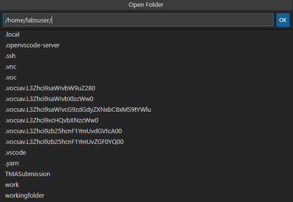
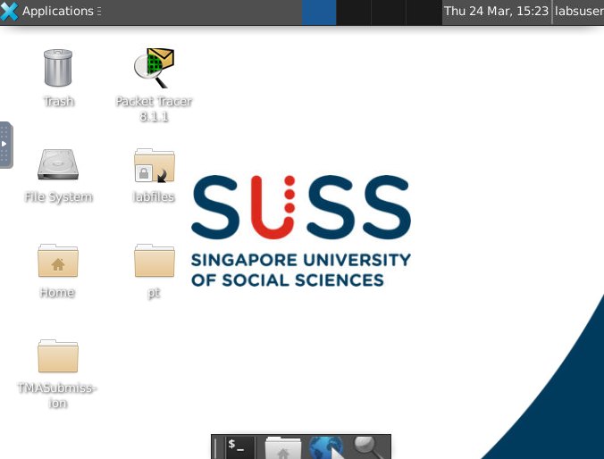
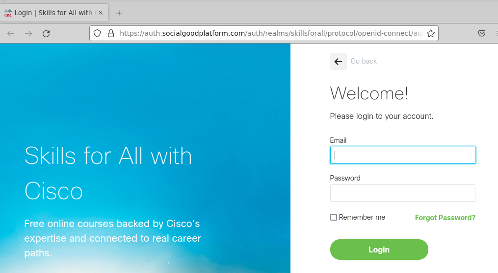
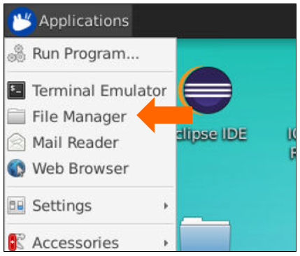

*sCHANGE LOG*

*[Version 0.1] – 26/01/2021*

* +++Section 4, 6 and 7:+++ Added new sections for respective Eclipse, Pycharm and Thonny IDE.

*[Version 0.2] – 27/01/2021*

* +++Section 14:+++ Clarified the page numbering on check list that needs to be resynched.
* +++Annexe:+++ Clarified the use of DBeaver.
* +++FAQ:+++ Removed question 3.

*[Version 0.3] – 29/01/2021*

* +++Section 4:+++ Added instruction to configure the interpreter to Python 3 for Eclipse.
* +++Section 12:+++ Added instruction to copy and paste text from local desktop to virtual desktop.
* +++Section 14:+++ Inserted screen capture for submission of assignment and zipped file to Canvas.
* +++Section 2 and Optional:+++ Moved the procedure for copying startlabscript file to bottom and labelled as optional.
* Released for ICT133_JAN21 class.

*[Version 0.4] – 01/02/2021*

* +++Section 2:+++ Edited the instructions for using command line to run startlabscript file.
* +++Section 8:+++ Added instructions to launch Jupyter Notebook application for Python 2 environment.
* Released for ICT233_JAN21 class.

*[Version 0.5] – 22/02/2021*

* +++Section 8:+++ Added a new section on Packet Tracer for ICT259.

*[Version 0.6] – 23/02/2021*

* +++Section 3:+++ Updated the instructions to configure desktop screen.

*[Version 0.7] – 07/03/2021*

* +++Section 2:+++ Changed startlabscript mechanism.
* +++Section 9:+++ Added a new section to start MongoDB server. This approach is to (1) preserve mongoDB database by storing user data under dbfiles folder (2) resolve the issue when server fails to start.
* +++Section 13:+++ Updated the method for recording by using LICEcap.
* +++Section 14:+++ Replaced screenshots using a different folder name, not to be confused with the designated submission folder.
* +++Section 14:+++ Applied requirement 1 & 2 for ICT233.
* +++Section 14:+++ Added instruction to check submission in WorkSpace.
* +++Appendix:+++ Removed section on Copy Startlabscript.
* +++Appendix:+++ Added information for troubleshooting MongoDB connection.

*[Version 0.7b] – 11/05/2021*

* +++Appendix A-4:+++ Updated the command line.
* +++Appendix A-+++5: Added new appendix for reconnecting virtual desktop.

*[Version 0.8] – 12/05/2021*

* +++Section 13:+++ Updated the method for recording by using Peek.

*[Version 0.8b] – 06/07/2021*

* +++Section 11:+++ Added a new section on EASY68K for ICT114.

*[Version 0.9c] – 12/01/2022*

* Implemented Theia, Jupyter lab container and reorganized the sections.

*[Version 0.9e] – 11/03/2022*

* +++Section 1+++: Added new section for browser requirements and configurations as advised by Vocareum.
* +++Section 3.1+++*:* Added new section to provide steps for copy/paste text from local desktop to Theia.
* +++Section 3.2+++*:* Added new section to create launch.json in Theia IDE for running Flask.
* +++Section 3.3+++*:* Provided steps for viewing or changing the version of the Python Interpreter (if necessary) in Theia IDE.
* +++Section 5+++: Remove to configure resolution by command line since remote resizing works well.
* +++Section 6.4+++: Updated Point C to refer student to Appendix A-6 for new account registration.
* +++Section 9+++*:* Updated Point G in regards to resubmission.
* +++Appendix A-5+++*:* Provided steps for new account registration via Skills For All.

*[Version 0.9f] – 16/03/2022*

* +++Section 6.4.1+++: Added new section for retrieval of file for lab exercise.

*[Version 0.9g] – 24/03/2022*

* +++Section 6.4+++: Updated the screenshot for Skilsforall login method.

*[Version 0.9h] – 29/03/2022*

* +++Appendix A-6+++*:* Provided steps for new account registration via Networking Academy.

*[Version 1.0] – 28/07/2022*

* +++Section 3 to 3.4 and 6.3+++*:* Updated the instructions for the new requirements of ICT239.

* +
*

Student User Guide for

Virtual Lab Infrastructure (VLI) Workspace

* +
*

== *TABLE OF CONTENTS*

link:#browser-requirements-and-configurations[*1.* *BROWSER REQUIREMENTS AND CONFIGURATIONS* link:#browser-requirements-and-configurations[3]]

link:#login-access-to-vocareum-lab[*2.* *LOGIN ACCESS TO VOCAREUM LAB* link:#login-access-to-vocareum-lab[4]]

link:++#access-to-cloud-ide---microsoft-edition-if-applicable-to-your-course++[*3.* *ACCESS TO CLOUD IDE - MICROSOFT EDITION (if applicable to your course)* link:++#access-to-cloud-ide---microsoft-edition-if-applicable-to-your-course++[6]]

link:#copypaste-text-from-local-desktop-to-ide[*3.1 COPY/PASTE TEXT FROM LOCAL DESKTOP TO IDE* link:#copypaste-text-from-local-desktop-to-ide[11]]

link:#creating-launch.json-file-for-debugging-flask-applications-if-applicable-to-your-course[*3.2 CREATING LAUNCH.JSON FILE FOR DEBUGGING FLASK APPLICATIONS (if applicable to your course)* link:#creating-launch.json-file-for-debugging-flask-applications-if-applicable-to-your-course[11]]

link:#launching-flask-app-browser-if-applicable-to-your-course[*3.3 LAUNCHING FLASK APP BROWSER (if applicable to your course)* link:#launching-flask-app-browser-if-applicable-to-your-course[14]]

link:#launching-html-browser-if-applicable-to-your-course[*3.4 LAUNCHING HTML BROWSER (if applicable to your course)* link:#launching-html-browser-if-applicable-to-your-course[15]]

link:#access-to-jupyterlab-ide-if-applicable-to-your-course[*4.* *ACCESS TO JUPYTERLAB IDE (if applicable to your course)* link:#access-to-jupyterlab-ide-if-applicable-to-your-course[17]]

link:#access-to-virtual-desktop[*5.* *ACCESS TO VIRTUAL DESKTOP* link:#access-to-virtual-desktop[20]]

link:#configuration-of-virtual-desktop-screen[*5.1 CONFIGURATION OF VIRTUAL DESKTOP SCREEN* link:#configuration-of-virtual-desktop-screen[22]]

link:#copypaste-text-from-local-desktop-to-virtual-desktop[*5.2 COPY/PASTE TEXT FROM LOCAL DESKTOP TO VIRTUAL DESKTOP* link:#copypaste-text-from-local-desktop-to-virtual-desktop[23]]

link:#virtual-desktop-applications[*6.* *VIRTUAL DESKTOP APPLICATIONS* link:#virtual-desktop-applications[26]]

link:#visual-studio-code-if-applicable-to-your-course[*6.1* *VISUAL STUDIO CODE (if applicable to your course)* link:#visual-studio-code-if-applicable-to-your-course[26]]

link:#jupyter-notebook-for-python-2-if-applicable-to-your-course[*6.2* *JUPYTER NOTEBOOK FOR PYTHON 2 (if applicable to your course)* link:#jupyter-notebook-for-python-2-if-applicable-to-your-course[27]]

link:#creating-mongodb-connection-if-applicable-to-your-course[*6.3* *CREATING MONGODB CONNECTION (if applicable to your course)* link:#creating-mongodb-connection-if-applicable-to-your-course[29]]

link:#cisco-packet-tracer-if-applicable-to-your-course[*6.4* *CISCO PACKET TRACER (if applicable to your course)* link:#cisco-packet-tracer-if-applicable-to-your-course[32]]

link:#retrieve-file-for-lab-exercise[*6.4.1RETRIEVE FILE FOR LAB EXERCISE* link:#retrieve-file-for-lab-exercise[34]]

link:#easy68k-editorassembler-if-applicable-to-your-course[*6.5* *EASY68K EDITOR/ASSEMBLER (if applicable to your course)* link:#easy68k-editorassembler-if-applicable-to-your-course[36]]

link:#end-lab-session[*7.* *END LAB SESSION* link:#end-lab-session[37]]

link:#create-recording-links-for-running-of-program-if-applicable-to-your-course[*8.* *CREATE RECORDING LINKS FOR RUNNING OF PROGRAM (if applicable to your course)* link:#create-recording-links-for-running-of-program-if-applicable-to-your-course[38]]

link:#submission-of-assignment-in-zip-format-if-applicable-to-your-course[*9.* *SUBMISSION OF ASSIGNMENT IN ZIP FORMAT (if applicable to your course)* link:#submission-of-assignment-in-zip-format-if-applicable-to-your-course[42]]

link:#task-list-of-tmaeca-submission-if-applicable-to-your-course[*10.* *TASK LIST OF TMA/ECA SUBMISSION (if applicable to your course)* link:#task-list-of-tmaeca-submission-if-applicable-to-your-course[49]]

link:#it-support[*11.* *IT SUPPORT* link:#it-support[50]]

link:#important-points-to-take-note-if-applicable-to-your-course[*12.* *IMPORTANT POINTS TO TAKE NOTE (if applicable to your course)* link:#important-points-to-take-note-if-applicable-to-your-course[50]]

link:#appendix-a-1-downloading-file-from-virtual-desktop[*13.* *APPENDIX A-1 [DOWNLOADING FILE FROM VIRTUAL DESKTOP]* link:#appendix-a-1-downloading-file-from-virtual-desktop[51]]

link:#appendix-a-2-uploading-of-file-to-virtual-desktop[*14.* *APPENDIX A-2 [UPLOADING OF FILE TO VIRTUAL DESKTOP]* link:#appendix-a-2-uploading-of-file-to-virtual-desktop[53]]

link:#appendix-a-4-re-connect-virtual-desktop[*15.* *APPENDIX A-4 [RE-CONNECT VIRTUAL DESKTOP]* link:#appendix-a-4-re-connect-virtual-desktop[54]]

link:#appendix-a-5-account-registration-for-cisco-skills-for-all[*16.* *APPENDIX A-5 [ACCOUNT REGISTRATION FOR CISCO SKILLS FOR ALL]* link:#appendix-a-5-account-registration-for-cisco-skills-for-all[54]]

link:#appendix-a-6-account-registration-for-cisco-networking-academy[*17.* *APPENDIX A-6 [ACCOUNT REGISTRATION FOR CISCO NETWORKING ACADEMY]* link:#appendix-a-6-account-registration-for-cisco-networking-academy[58]]

link:#annexe[*18.* *ANNEXE* link:#annexe[62]]

link:#faq[*19.* *FAQ* link:#faq[62]]

== *BROWSER REQUIREMENTS AND CONFIGURATIONS*

To ensure consistency and the best user experience in web browser when accessing Vocareum Lab, we would recommend students to use https://www.google.com/intl/en_sg/chrome/[Google Chrome] (Click the link to install if it is not available on your computer). As best practice to configure the browser, please follow the configurations below.

[loweralpha]
. Update the web browser to the latest version.
. System Requirements (Please refer https://support.google.com/chrome/a/answer/7100626[here] for the latest information):
[lowerroman]
.. {blank}
+
____
Windows
____
[arabic]
... {blank}
+
____
Windows 7, Windows 8, Windows 8.1 or Windows 10
____
... {blank}
+
____
An Intel Pentium 4 processor or later that’s SSE3 capable
____
.. {blank}
+
____
MAC OS
____
[arabic]
... {blank}
+
____
OS X EI Capitan 10.11 or later
____
.. {blank}
+
____
Linux OS
____
[arabic]
... {blank}
+
____
64 bit Ubuntu 18.04+, Debian 10+, openSUSE 15.2+, or Fedora Linux 32+
____
... {blank}
+
____
An Intel Pentium 4 processor or later that's SSE3 capable
____
. Configure browser to allow third-party cookies from Vocareum. The screenshots provided at the time of writing is based on version +++102.0.5005.63+++.
[lowerroman]
.. {blank}
+
____
Open Chrome browser.
____
.. {blank}
+
____
On the URL bar, enter *chrome://settings/cookies*
____

____
image:extracted-media/media/image1.png[image,width=426,height=73]
____

[lowerroman, start=3]
. {blank}
+
____
Scroll down the page until you see this section – *Sites that can always use cookies* and click on the *Add* button.
____

____

____

[lowerroman, start=4]
. {blank}
+
____
In the Add a site box, enter *[*.]labs.vocareum.com* into the Site prompt and check *Including third-party cookies on this site*.
____

____
image:extracted-media/media/image3.png[image,width=430,height=128]
____

[lowerroman, start=5]
. {blank}
+
____
Click *Add* button to add and the prompt box will close.
____

____
image:extracted-media/media/image4.png[image,width=384,height=166]
____

[lowerroman, start=6]
. {blank}
+
____
You will notice that your entry is now displayed at this section.
____

____
image:extracted-media/media/image5.png[image,width=318,height=81]
____

[lowerroman, start=7]
. {blank}
+
____
Restart your Chrome browser.
____

[arabic, start=2]
. {blank}
+
== *LOGIN ACCESS TO VOCAREUM LAB*
[loweralpha]
.. Go to https://canvas.suss.edu.sg and log in to your account.

____
image:extracted-media/media/image6.png[image,width=263,height=334]
____

[loweralpha, start=2]
. Navigate to your course site and select *Vocareum Labs* under the Courses menu.

[loweralpha, start=3]
. For first-time users, you will encounter the Vocareum Terms and Conditions, please scroll down to indicate that you agree with the terms and conditions.

[loweralpha, start=4]
. Subsequently, the platform will automatically show the lab that is relevant to your course. To access the lab environment, please click on +++My Work+++ button.

image:extracted-media/media/image9.png[image,width=550,height=283]

Please refer to the respective section that is applicable for your course.

[lowerroman]
. link:++#access-to-cloud-ide---microsoft-edition-if-applicable-to-your-course++[Section 3 – Access to Cloud IDE]
. link:#access-to-jupyterlab-ide-if-applicable-to-your-course[Section 4 – Access to Jupyter Notebook IDE]
. link:#access-to-virtual-desktop[Section 5 – Access to Virtual Desktop]
. link:#virtual-desktop-applications[Section 6 – Virtual Desktop Applications]

____
After reading these sections, move on to link:#end-lab-session[Section 7].
____

[arabic, start=3]
. {blank}
+
== *ACCESS TO CLOUD IDE - MICROSOFT EDITION (if applicable to your course)*
[loweralpha]
.. Please wait for the IDE to finish loading. Once it is done, your IDE should look like the sample screenshot below.

image:extracted-media/media/image10.png[image,width=484,height=378]

[loweralpha, start=2]
. Click on +++Application Menu+++ first, followed by +++File+++ and click on +++New Window+++. This will open the Cloud IDE in a new browser tab.

image:extracted-media/media/image11.png[image,width=517,height=264]

[loweralpha, start=3]
. Click on the Explorer icon first then +++Open Folder+++ button.

image:extracted-media/media/image12.png[image,width=491,height=241]

[loweralpha, start=4]
. Enter the following directory path (/home/labsuser) into the prompt box and click on the *OK* button. The web browser will load and list the files in the specified directory.

image:extracted-media/media/image13.png[image,width=534,height=119]

[loweralpha, start=5]
. To create a working folder of your own preference, right click at the empty space of the file structure and select *New Folder.*

image:extracted-media/media/image14.png[image,width=573,height=568]

[loweralpha, start=6]
. Enter the name of the folder of your own preference in the blue box and press Enter on the keyboard to save the change.

image:extracted-media/media/image15.png[image,width=345,height=97]

[loweralpha, start=7]
. The folder that you have just created will be listed under the LABSUSER file tree.

[loweralpha, start=8]
. Next, click on the Application Menu first, followed by File and then select *Open Folder…*

[loweralpha, start=9]
. In the Open Folder prompt box, please ensure that you click and follow the folder name correctly. The format is /home/labsuser/<your working folder>.

image:extracted-media/media/image18.png[image,width=407,height=84]

Once the path is correct, click on OK button to proceed.

image:extracted-media/media/image20.png[image,width=417,height=57]

[loweralpha, start=10]
. The browser tab will load your specified folder for your usage. Do note that the file(s) will be saved under this directory: /home/labsuser/<name_of_working_folder>

image:extracted-media/media/image21.png[image,width=568,height=275]

== *3.1 COPY/PASTE TEXT FROM LOCAL DESKTOP TO IDE*

[loweralpha]
. From your local desktop, highlight and copy the text of your preference.

image:extracted-media/media/image22.png[image,width=314,height=140]

[loweralpha, start=2]
. Point the cursor back to IDE. Hold down the Ctrl key and press V on your keyboard to paste the text to be copied.

image:extracted-media/media/image23.png[image,width=271,height=102]

== *3.2 CREATING LAUNCH.JSON FILE FOR DEBUGGING FLASK APPLICATIONS (if applicable to your course)*

Note: This section assumes that you have already opened your folder at the application root level where it contains the app.py file.

[loweralpha]
. In the IDE left panel, click on the *Run and Debug* button that is highlighted in orange.

____
image:extracted-media/media/image24.png[Graphical user interface, application Description automatically generated,width=310,height=204]
____

[loweralpha, start=2]
. Under the *RUN AND DEBUG* section, please click on *create a launch.json file* link. If there is an existing Python: Flask configuration, please skip step c-g.

image:extracted-media/media/image24.png[Graphical user interface, application Description automatically generated,width=377,height=249]

[loweralpha, start=3]
. The IDE will prompt for the environment. Please select *Python*.

[loweralpha, start=4]
. Under the debug configuration prompt, click Flask.

image:extracted-media/media/image26.png[Text Description automatically generated,width=538,height=237]

[loweralpha, start=5]
. The IDE will automatically open the launch.json configuration and the necessary contents will be populated.

image:extracted-media/media/image27.png[Text Description automatically generated,width=527,height=268]

[loweralpha, start=6]
. Please add the following changes under the env section in the launch.json file.
[lowerroman]
.. Please add a comma at the end of the last entry behind the word development
.. Please add a new line “FLASK_RUN_HOST”: “0.0.0.0”

____
image:extracted-media/media/image28.png[Text Description automatically generated,width=350,height=444]
____

[loweralpha, start=7]
. Please save the launch.json file after making the changes.
. You may now run your flask application in debugging mode by clicking on the green play button.

image:extracted-media/media/image29.png[Graphical user interface, text, application, chat or text message Description automatically generated,width=352,height=221]

== *3.3 LAUNCHING FLASK APP BROWSER (if applicable to your course)*

[loweralpha]
. Please run your flask application in IDE first. A sample image shown below.

image:extracted-media/media/image30.png[image,width=459,height=99]

[loweralpha, start=2]
. On your workspace, you will see that there are several links displayed. Please click on the flask_app_browser link.

image:extracted-media/media/image31.png[image,width=501,height=187]

[loweralpha, start=3]
. A new browser tab will be opened with your flask application. You can then start to interact with your application.

[loweralpha, start=4]
. Please note that when you will encounter a “*503 Service Unavailable*” error when you click on the flask_app_browser link without running your flask application.

image:extracted-media/media/image33.png[image,width=382,height=131]

== *3.4 LAUNCHING HTML BROWSER (if applicable to your course)*

[loweralpha]
. Please note that this HTML browser is provided to view the sample codes in the past references folder.
. On your workspace, please click on the html_browser link.

image:extracted-media/media/image31.png[image,width=457,height=170]

[loweralpha, start=3]
. A new browser tab will be opened in another window. Please click on the *ICT239 Past References* link as this is the folder that contains all the reference codes.

image:extracted-media/media/image34.png[image,width=244,height=329]

[loweralpha, start=4]
. To view the sample codes, simply navigate to the folder that you wish to view the codes.

image:extracted-media/media/image35.png[image,width=519,height=242]

image:extracted-media/media/image36.png[image,width=520,height=340]

[loweralpha, start=5]
. Please take note that if you have made any changes to the html files, please refresh your web browser to view the latest changes.

[arabic, start=4]
. {blank}
+
== *ACCESS TO JUPYTERLAB IDE (if applicable to your course)*
[loweralpha]
.. Please click on the *+++My Work+++* button to access the JUPYTERLAB IDE.

image:extracted-media/media/image37.png[image,width=555,height=262]

[loweralpha, start=2]
. Please wait for the IDE to finish loading. Once it is done, your IDE should look like the sample screenshot below.

[loweralpha, start=3]
. To create a working folder, right click on the file structure and select *New Folder.* Then name the *New Folder* of your preference.

image:extracted-media/media/image39.png[image,width=460,height=377]

[loweralpha, start=4]
. To create a new notebook under the new folder, double click on that folder.

[loweralpha, start=5]
. After clicking, do note that the directory has changed to the new folder.

image:extracted-media/media/image41.png[image,width=459,height=198]

[loweralpha, start=6]
. Click on the Python 3 button under Notebook.

image:extracted-media/media/image42.png[image,width=201,height=222]

[loweralpha, start=7]
. You may rename the new ipynb file by right click and *Rename* it. (You may start to use).

image:extracted-media/media/image43.png[image,width=573,height=312]

[arabic, start=5]
. {blank}
+
== *ACCESS TO VIRTUAL DESKTOP*
[loweralpha]
.. Click on *desktop* link in the Workspace as pointed to by arrow below. This action will launch the Virtual Desktop. If you do not see the Virtual Desktop launched due to being blocked by pop-up blocker, please allow the pop-up blocker to open a new window/tab from Vocareum.

[loweralpha, start=2]
. You will see a separate browser tab with a noVNC logo. Next, click on *Connect* button to connect to Virtual Desktop.

image:extracted-media/media/image45.png[image,width=227,height=108]

[loweralpha, start=3]
. Once upon accessing Virtual Desktop for the first time, system will generate the following shortcuts on your desktop automatically. *(No action is required from student for creating these shortcuts)*

{empty}1. Pre-installed applications and libraries for your course.footnote:[Refer to link:#annexe[Annexe] for the list of applications and libraries.]

{empty}2. Specific folders where you begin working your solution for graded assignments.

{empty}3. Folder containing references from past references. (If applicable for your course)

image:extracted-media/media/image46.png[image,width=601,height=505]

The icons may appear over a short period, once an icon appears, it is ready for the users to use that software.

== *5.1* *CONFIGURATION OF VIRTUAL DESKTOP SCREEN*

You can adjust the screen to a higher resolution by the following steps:

[loweralpha]
. Click the bar with an arrow to toggle the noVNC control panel.

image:extracted-media/media/image47.png[image,width=226,height=192]

[loweralpha, start=2]
. Click the Settings icon on the noVNC control panel.

image:extracted-media/media/image48.png[image,width=73,height=202]

[loweralpha, start=3]
. Select Remote Resizing under Scaling Mode option. This option will allow the desktop to fit into any custom sizing of the web browser.

image:extracted-media/media/image49.png[image,width=153,height=205]

[loweralpha, start=4]
. Once this setting is done, you can drag and pull the browser frame.

image:extracted-media/media/image50.png[image,width=187,height=78]

[loweralpha, start=5]
. You can also enter the full screen mode by clicking on the Fullscreen icon.

image:extracted-media/media/image51.png[image,width=74,height=208]

== *5.2* *COPY/PASTE TEXT FROM LOCAL DESKTOP TO VIRTUAL DESKTOP*

[loweralpha]
. From your local desktop, highlight and copy the text of your preference.

image:extracted-media/media/image22.png[image,width=314,height=140]

[loweralpha, start=2]
. Navigate to your virtual desktop and click the bar with an arrow to toggle the noVNC control panel.

image:extracted-media/media/image52.png[image,width=426,height=305]

[loweralpha, start=3]
. Click the *Clipboard* icon on the noVNC control panel.

image:extracted-media/media/image53.png[image,width=416,height=305]

[loweralpha, start=4]
. Paste the text to be copied on the Clipboard.

image:extracted-media/media/image54.png[image,width=492,height=360]

[loweralpha, start=5]
. Hold Ctrl and then press V on your keyboard to paste the text to be copied. You can also do a right click on your mouse and paste that text.

image:extracted-media/media/image55.png[image,width=533,height=392]

[loweralpha, start=6]
. Click the *Clipboard* icon on the noVNC control panel to close the Clipboard.

[arabic, start=6]
. {blank}
+
== *VIRTUAL DESKTOP APPLICATIONS*
[arabic]
.. {blank}
+
== *VISUAL STUDIO CODE (if applicable to your course)*
[loweralpha]
.. Click on *Visual Studio Code* shortcut located on the desktop.

____

____

[loweralpha, start=2]
. The application displayed will be the same as screenshot below.

____
image:extracted-media/media/image58.png[image,width=571,height=375]
____

== *JUPYTER NOTEBOOK FOR PYTHON 2 (if applicable to your course)*

[loweralpha]
. Click on *Python 2 Jupyter Notebook* shortcut located on the desktop.

____
*Note 1:* To run application that uses Python 2 virtual environment, please select and click the *Python 2 Jupyter Notebook* shortcut instead. An example of application that uses Python 2 virtual environment is d3py library.

image:extracted-media/media/image59.png[image,width=513,height=422]

image:extracted-media/media/image60.png[image,width=549,height=322]

*Warning: Do NOT close this Terminal screen as it is required to run Jupyter Notebook. Please keep it minimised.*
____

[loweralpha, start=2]
. The application displayed will be the same as screenshot below.

____
image:extracted-media/media/image61.png[image,width=441,height=280]
____

[loweralpha, start=3]
. To exit from this application after you have finished using it, click on *Quit* button.footnote:[Do remember to save your work first before exit.]

____
image:extracted-media/media/image62.png[image,width=521,height=334]
____

[loweralpha, start=4]
. A shut down message will be prompted. Then, click the *cross* to end this message.

____
image:extracted-media/media/image63.png[image,width=365,height=117]
____

[loweralpha, start=5]
. Switch to Terminal Emulator and enter *exit* into the command line to close the Terminal.

____

____

== *CREATING* *MONGODB CONNECTION (if applicable to your course)* 

[loweralpha]
. In IDE, click on the MongoDB icon on the left menu.

____
image:extracted-media/media/image65.png[image,width=294,height=309]
____

[loweralpha, start=2]
. Click on the Add Connection button.

____
image:extracted-media/media/image65.png[image,width=294,height=309]
____

[loweralpha, start=3]
. The MongoDB page will be shown.

____
image:extracted-media/media/image66.png[image,width=507,height=331]
____

[loweralpha, start=4]
. Click on the *Connect* button.

____
image:extracted-media/media/image67.png[image,width=296,height=156]
____

[loweralpha, start=5]
. A prompt box will appear to ask for the database connection string.

____

____

[loweralpha, start=6]
. Enter *+++mongodb://localhost:27017+++* into the prompt box and press *Enter* to continue.

____
image:extracted-media/media/image69.png[image,width=528,height=47]
____

[loweralpha, start=7]
. Once it is successfully connected, you will be able to view this notification message at the bottom right corner of the screen.

____
image:extracted-media/media/image70.png[image,width=410,height=50]
____

[loweralpha, start=8]
. On the mongoDB page, it will show that it is successfully connected to the database as well.

____

____

== *CISCO PACKET TRACER (if applicable to your course)*

[loweralpha]
. Click on *Cisco Packet Tracer* shortcut located on the desktop.

____

____

[loweralpha, start=2]
. If you have not registered an account with Cisco Skills For All, please refer to link:#appendix-a-5-account-registration-for-cisco-skills-for-all[Appendix A-5] for instructions. Otherwise, you may proceed to login with your credentials by clicking the *Skills For All* button on the right.
[lowerroman]
.. For those who choose to register with Networking Academyfootnote:[(a) If you have already registered with Skills For All, you do not have to register with Networking Academy as this is an option provided for student. (b) The procedure to register with Networking Academy is provided on link:#appendix-a-6-account-registration-for-cisco-networking-academy[Appendix A-6.]], please click the *Networking Academy* button on the left.

____
image:extracted-media/media/image73.png[image,width=545,height=243]
____

[loweralpha, start=3]
. Once the login page is launched in a web browser, enter your *Email* and *Password*.

____

____

[loweralpha, start=4]
. Click on the *Login* button.

____

____

[loweralpha, start=5]
. The application displayed will be the same as the screenshot below.

____

____

== *6.4.1RETRIEVE FILE FOR LAB EXERCISE*

[loweralpha]
. A shortcut link to a directoryfootnote:[This particular directory has read only access. If you need to save the file, please choose Home directory.] where the lab files are stored, has been placed on your desktop just like the screenshot below. You can double click *+++labfiles+++* link to read those lab files. If you do not have the shortcut link, please follow Step B to E to create it.

____
image:extracted-media/media/image77.png[image,width=326,height=217]
____

[loweralpha, start=2]
. Double click File System Folder.

____
image:extracted-media/media/image77.png[image,width=249,height=166]
____

[loweralpha, start=3]
. Go to docs subfolder by entering this path: /voc/lab/docs/

____
image:extracted-media/media/image78.png[image,width=318,height=155]
____

[loweralpha, start=4]
. Right click the lab file and select +++Desktop (Create Link)+++ under Send To option.

____

____

[loweralpha, start=5]
. A shortcut link will be placed on the desktop just like the screenshot below.

____
image:extracted-media/media/image80.png[image,width=250,height=180]
____

== *EASY68K EDITOR/ASSEMBLER* *(if applicable to your course)*

[loweralpha]
. Click on *Easy68k Editor* short-cut located on the desktop.

____
image:extracted-media/media/image81.png[image,width=507,height=390]
____

[loweralpha, start=2]
. If you are launching this application for the first time, a messagefootnote:[The installation may take up to 5 minutes to complete.] will be prompted.

____
image:extracted-media/media/image82.png[image,width=512,height=375]
____

[loweralpha, start=3]
. The application displayed will be the same as the screenshot below.

____
image:extracted-media/media/image83.png[image,width=538,height=426]
____

== *END LAB SESSION*

Navigate to +++Workspace+++ and click on *End Lab* link to end your lab session as shown in the screenshot below.footnote:[Do remember to save your work first before ending the lab session.]

image:extracted-media/media/image84.png[image,width=581,height=74]

== *CREATE RECORDING LINKS FOR RUNNING OF PROGRAM (if applicable to your course)*

[loweralpha]
. Open the program that needs to be recorded.

____
image:extracted-media/media/image85.png[image,width=484,height=230]
____

[loweralpha, start=2]
. Navigate to desktop and click on *Peek* shortcut.

____
image:extracted-media/media/image86.png[image,width=497,height=403]
____

[loweralpha, start=3]
. Position the Peek frame to cover the entire area of screen that needs to be recorded.

____
image:extracted-media/media/image87.png[image,width=483,height=361]
____

[loweralpha, start=4]
. Click on *Record as GIF* button to start recording. Please keep the file format type as GIF.

____

____

[loweralpha, start=5]
. Once you have completed your recording, click on *Stop* button.

____

____

[loweralpha, start=6]
. Save this file under the *recordings*footnote:[If you do not see this folder, please create it manually.] folder.

____

____

[loweralpha, start=7]
. Enter a file name and then click on *Save* button. Please keep the format of file as GIF type.

____
image:extracted-media/media/image91.png[image,width=426,height=293]
____

[loweralpha, start=8]
. Please wait while the recording is being processed. A notification will pop out at the top right-hand corner of the screen to inform you that the animated GIF is saved successfully. Click “*Show in file manager*” to view your saved file.

____
image:extracted-media/media/image92.png[Graphical user interface, text, application Description automatically generated,width=433,height=143]
____

[loweralpha, start=9]
. The folder will display to show the saved recording file.

____
image:extracted-media/media/image93.png[image,width=296,height=141]
____

[loweralpha, start=10]
. To review the recording, use either Google Chrome or Firefox web browser to open the recording file.

____
image:extracted-media/media/image94.png[image,width=407,height=129]
____

== *SUBMISSION OF ASSIGNMENT IN ZIP FORMAT (if applicable to your course)*

____
Once you have completed developing your assignment, please ensure that all final version of files are deposited correctly in the respective submission folders as shown in the Table A below. Grader will be accessing these folders to grade your submitted work.
____

[width="100%",cols="29%,38%,33%",options="header",]
|===
|*Graded Assignment* |*Submission folder name shown on desktop* |*Zip File Name*
|Tutor-Marked Assignment |TMASubmission |*tma.zip*
|End-of-Course Assignment |ECASubmission |*eca.zip*
|===

*+++Table A+++*

Note: Please note that the Zip File Name is *+++case sensitive+++*. Do follow the naming convention as shown in the table above.

[loweralpha]
. Assuming the solution folders could look like the sample shown below.

____

____

Note: If you are taking ICT239 course, you should (1) remove the python virtual environment directory (2) retain the requirements.txt file in the main submission folder. This requirements.txt will contain the list of python libraries used for your solution and can be used to repopulate the libraries when the submission is done for further development.

[loweralpha, start=2]
. Zip up your final version of submission with Archive tool. It can be achieved by the following steps.
[lowerroman]
.. Click to open *File Manager* from Applications Menu.

____
image:extracted-media/media/image96.png[image,width=199,height=170]
____

[lowerroman, start=2]
. Navigate to the folder where your final version of files are stored.

____
image:extracted-media/media/image97.png[image,width=482,height=316]
____

[lowerroman, start=3]
. Right-click on that particular folder and click *Create Archive* to open tool.

____
image:extracted-media/media/image98.png[image,width=503,height=404]
____

[lowerroman, start=4]
. With reference from the above Table A, enter the name of zip file in the Name field. Please note that the naming is +++case sensitive+++.

____

____

[lowerroman, start=5]
. Select *zip* from Archive type menu.

____

____

[lowerroman, start=6]
. Click on *Create* button to create the zipped file.

____

____

[lowerroman, start=7]
. Copy and paste the zipped file into the submission folder.

____
image:extracted-media/media/image102.png[image,width=491,height=323]
____

[loweralpha, start=3]
. Navigate to WorkSpace and click *+++Submit+++* button to submit your assignment.

image:extracted-media/media/image103.png[image,width=441,height=91]

[loweralpha, start=4]
. A confirmation message will be prompted. Then, click *Yes* button to confirm submission.

[loweralpha, start=5]
. A *Submission recorded* message will flash on the bottom right corner of screen.

image:extracted-media/media/image105.png[image,width=292,height=104]

[loweralpha, start=6]
. Use the file browser on the left panel to expand the *Submissions* folder. Do a check just to make sure that the system did capture all the files that you have submitted in the latest submission count.

image:extracted-media/media/image106.png[image,width=296,height=408]

[loweralpha, start=7]
. After you have submitted the zip file of your solution on Vocareum, you need to submit both the report and zip files on Canvas.

Follow the steps below to submit your report and zip file

[lowerroman]
. Click on +++Vocareum Labs+++ on the left menu to show the dashboard and do a print screen of the submission details as shown in sample below.

____
image:extracted-media/media/image107.png[image,width=558,height=278]
____

_+++Sample of print screen to be entered in the TMA/ECA report+++_

[lowerroman, start=2]
. Copy and paste the print screen of submission detail into your TMA/ECA report.

____
*Important!*

As shown above, the submitted **date/time stamp of the final version of your solution **will serve as your *proof of submission* in Workspace. Thereafter, grader will grade based on your final submission. *Students are allowed to make multiple submissions before the assignment due date, nonetheless please repeat the above steps (b-g). Students are advised not to submit on Vocareum Lab again once the final version of report is submitted on Canvas as the timestamp on the final version of report should match with the last submission on Vocareum.*
____

[lowerroman, start=3]
. Navigate to Canvas and select either *TMA01* or *ECA* link under *Assignments* to submit word document report for the respective TMA and ECA assignments.

____
image:extracted-media/media/image108.png[image,width=429,height=420]

For further instructions on submission of assignment, please download *Canvas User Guide for Students* from Learning Services (LS) Support Portal via the link below:

https://suss.force.com/lssupport/s/userguideforstudent
____

[lowerroman, start=4]
. Repeat the same steps as *Step iii* for submission of zip file. Please note that you are required to select either -*TMA.zip* or -*ECA.zip* link when submitting your zip file for the respective TMA and ECA assignments.

____

____

== *TASK LIST OF TMA/ECA SUBMISSION (if applicable to your course)*

____
While you are submitting your assignment to SUSS Canvas, use the following Task Lists (a) and (b) to help guide your steps.
____

*Task List (a)*

[width="100%",cols="61%,14%,25%",options="header",]
|===
|*Description of Task* a|
*Completed*

*(Put a tick)*

|*From Student Reference Guide*
a|
[arabic]
. Configured your Chrome browser settings.

|☐ |link:#browser-requirements-and-configurations[Section 1]
a|
[arabic, start=2]
. Accessed to Cloud IDE and Virtual Desktop Applications that are applicable for your course.

|☐ |Section link:#login-access-to-vocareum-lab[2], link:++#access-to-cloud-ide---microsoft-edition-if-applicable-to-your-course++[3], link:#access-to-jupyterlab-ide-if-applicable-to-your-course[4], link:#access-to-virtual-desktop[5] and link:#virtual-desktop-applications[6]
a|
[arabic, start=3]
. Having the following shortcuts created on your virtual desktop:

| |link:#access-to-virtual-desktop[Section 5]
a|
* Applications or libraries that is available to your course (Refer to Annexe)

|☐ |
a|
* Folder containing past references

|☐ |
a|
* Empty folder to be used for assignment submission:

| |
a|
* TMASubmission

|☐ |
a|
* ECASubmission

|☐ |
a|
[arabic, start=4]
. Once you have developed your assignment,

| |
a|
[arabic]
. Created recording for running of program. Place the recording in the submission folder.

|☐ |link:#create-recording-links-for-running-of-program-if-applicable-to-your-course[Section 8]
a|
[arabic, start=2]
. Organised and deposited your final version of solution into separate folders for each question.

|☐ |link:#submission-of-assignment-in-zip-format-if-applicable-to-your-course[Section 9]
a|
[arabic, start=3]
. Removed the virtual environment directory in the submission folder which includes all the sub-folder(s).

|☐ |
a|
[arabic, start=4]
. Deposited a copy of requirements.txt file in the submission folder.

|☐ |
a|
[arabic, start=5]
. Zipped up your final version of solution.

|☐ |
a|
[arabic, start=6]
. Named the zipped file correctly.

|☐ |
a|
[arabic, start=7]
. Placed the zipped file in the submission folder.

|☐ |
a|
[arabic, start=5]
. Submitted assignment in Vocareum Lab.

|☐ |link:#submission-of-assignment-in-zip-format-if-applicable-to-your-course[Section 9]
a|
[arabic, start=6]
. Verified the submitted files are captured by system.

|☐ |link:#submission-of-assignment-in-zip-format-if-applicable-to-your-course[Section 9]
a|
[arabic, start=7]
. Completed Task List (a) and (b).

|☐ |link:#task-list-of-tmaeca-submission-if-applicable-to-your-course[Section 10]
a|
[arabic, start=8]
. Submitted assignment in Canvas.

|☐ |link:#submission-of-assignment-in-zip-format-if-applicable-to-your-course[Section 9]
|===

*Task List (b) – To be copy and paste into your report*

[width="100%",cols="23%,42%,15%,20%",options="header",]
|===
|*Description* |*[Information to be provided by student]* a|
*Completed*

*(Put a tick)*

|*From Student Reference Guide*
|Print Screen of Submission Details from Vocareum Lab: | |☐ |link:#submission-of-assignment-in-zip-format-if-applicable-to-your-course[Section 9]
|Please indicate that your program can run on Vocareum Lab: a|
For example:

Question 1: Yes

Question 2: No

Question 3: Yes

|☐ |Answer either Yes or No.
|Please provide the file names of recordings in the recordings sub folder. a|
For example:

Question 1: Q1.gif

Question 2: Nil.

Question 3: Q3.gif

|☐ |link:#create-recording-links-for-running-of-program-if-applicable-to-your-course[Section 8]
|===

== *IT SUPPORT*

Should you have any query or issues encountered, please use the discussion forum in Canvas for clarification. Alternatively, you may contact the administrator via email at vlisupport@suss.edu.sg for further support.

== *IMPORTANT POINTS TO TAKE NOTE (if applicable to your course)*

[loweralpha]
. Students’ final version of solution code are required to be zipped and deposited in the submission folder. For those who choose to develop their work locally, they would be responsible themselves for issues encountered in the local platform and to perform by uploading their files to the default Vocareum platform so that instructor can unzip it and run the source code.
. The solution code will ONLY be accepted on Vocareum when the Word Document report for Turnitin is also submitted. Otherwise, it will be considered as invalid.

==  +
*APPENDIX A-1 [DOWNLOADING FILE FROM VIRTUAL DESKTOP]*

____
To download file from virtual desktop to your local computer, please use the steps below:
____

[loweralpha]
. Copy the file(s) that you need.
. Click to open *File Manager* from Applications menu.

[loweralpha, start=3]
. Navigate to the following path in File Manager:

*/home/labsuser/*

image:extracted-media/media/image111.png[image,width=413,height=251]

[loweralpha, start=4]
. Paste those file(s) into this folder. If there are multiple files, you may wish to create a temporary folder to hold it first.

image:extracted-media/media/image112.png[image,width=409,height=248]

[loweralpha, start=5]
. Navigate to +++WorkSpace Terminal+++ and click on *Reload* icon as pointed to by arrow below. This action will reload the contents of the work folder.

image:extracted-media/media/image113.png[image,width=254,height=237]

[loweralpha, start=6]
. To ensure the file(s) is reloaded correctly, expand work/Temp folder to verify that those file(s) is present.

[loweralpha, start=7]
. Select the file(s) that you need and then click *Download* button.

image:extracted-media/media/image115.png[image,width=271,height=252]

[loweralpha, start=8]
. System will compress the selected file into Zip. Click *Download zipped source* link to download and save those file(s) into local computer.

image:extracted-media/media/image116.png[Graphical user interface, text, application Description automatically generated,width=433,height=132]

== *APPENDIX A-2 [UPLOADING OF FILE TO VIRTUAL DESKTOP]*

____
To upload file from your local computer to virtual desktop, please use the steps below:
____

[loweralpha]
. Go to WorkSpace Terminal and select *work* folder.

image:extracted-media/media/image117.png[image,width=300,height=271]

[loweralpha, start=2]
. Click on *Upload* button and open the file that you need.

[loweralpha, start=3]
. System will start to process the upload and will prompt successful when completed.

image:extracted-media/media/image119.png[image,width=388,height=82]

[loweralpha, start=4]
. Navigate to Virtual Desktop to verify those uploaded files. They should be located in the File Manager when you access this path.

*/home/labsuser/*

== *APPENDIX A-4 [RE-CONNECT VIRTUAL DESKTOP]*

How to resolve connection error when connection to virtual desktop is lost?

A sample of the error is shown below:

____
image:extracted-media/media/image120.png[image,width=589,height=256]
____

[loweralpha]
. Close the browser tab.
. Repeat Step 5a and 5b under link:#access-to-virtual-desktop[Section 5] to reconnect the virtual desktop.
. If the same error occurs,
[lowerroman]
.. Repeat the step under link:#end-lab-session[Section 7] to end the current lab session.
.. Then click Start Lab to start a new lab session.

== *APPENDIX A-5 [ACCOUNT REGISTRATION FOR CISCO SKILLS FOR ALL]*

[loweralpha]
. Go to https://skillsforall.com/course/getting-started-cisco-packet-tracer and click the *Get Started* button.

____

____

[loweralpha, start=2]
. Click the Sign up link.

____
image:extracted-media/media/image122.png[image,width=442,height=407]
____

[loweralpha, start=3]
. Select Country, Year of Birth and Month of Birth and then click the Continue button.

____
image:extracted-media/media/image123.png[image,width=390,height=348]
____

[loweralpha, start=4]
. Enter First name, Last name, Email, Password and then click the Create account button. *For Email, please enter your SUSS email address.*

____
image:extracted-media/media/image124.png[image,width=390,height=387]
____

[loweralpha, start=5]
. Enter First name, Last name, Email, Password and then click the Create account button.

____
image:extracted-media/media/image125.png[image,width=396,height=368]
____

[loweralpha, start=6]
. Check your mailbox to make sure that you have received an Enrolment Notification email that looks like the sample below.

image:extracted-media/media/image126.png[image,width=349,height=366]

[loweralpha, start=7]
. You may return to link:#cisco-packet-tracer-if-applicable-to-your-course[Section 6.4] for login via *Skills For All* button.

== *APPENDIX A-6 [ACCOUNT REGISTRATION FOR CISCO NETWORKING ACADEMY]*

[loweralpha]
. Navigate to the self-enrolment website by clicking the URL link posted on the VLI Support Discussion Forum in Canvas L-group.
. Upon access to the website, enter Country, Birth Month and Birth Year, then click the *Next Account Details* button.

[loweralpha, start=3]
. Enter your Particulars, Email (use SUSS email address), State, Captcha and then click the *Submit* button.

image:extracted-media/media/image128.png[image,width=456,height=401]

[loweralpha, start=4]
. Once the form is submitted, the website will display a message same as the screenshot below.

image:extracted-media/media/image129.png[image,width=470,height=209]

[loweralpha, start=5]
. Check your SUSS mailbox for an email sent from Netacad.com and click the *Activate Account* button.

[loweralpha, start=6]
. When a new page is launched, enter your new password and repeat to confirm. Then click *Create My Account* button.

[loweralpha, start=7]
. Choose the option required for the question about experience and then click *Create Account* button.

image:extracted-media/media/image132.png[image,width=477,height=335]

[loweralpha, start=8]
. Once your account is created successfully, the website will display a message same as the screenshot below.

image:extracted-media/media/image133.png[image,width=501,height=457]

[loweralpha, start=8]
. You may return to link:#cisco-packet-tracer-if-applicable-to-your-course[Section 6.4] for login via *Networking Academy* button.

== *ANNEXE*

____
The following is the list of applications that have been pre-installed in the virtual desktop.
____

[width="100%",cols="19%,81%",options="header",]
|===
|*No* |*Application Name*
|1. |Web Browsers (Firefox and Chrome)
|2. |Visual Studio Code
|3. |Python3.6 – 3.7
|4. |Virtual Environment (venv)
|5. |Jupyter Notebook
|6. |MongoDB Server
|7. |Peek
|8. |Code-Server
|9. |JupyterLab
|10. |Wine
|11. |Packet Tracer
|12. |EASy68k
|===

== *FAQ*

[arabic]
. *The loading of WorkSpace is taking a long time to load.*

Students who are accessing their WorkSpace for the first-time might experience a longer time to load as the system is performing the initialization process. Please be advised not to close the web browser and wait until the loading is completed.

*---END OF GUIDE---*
